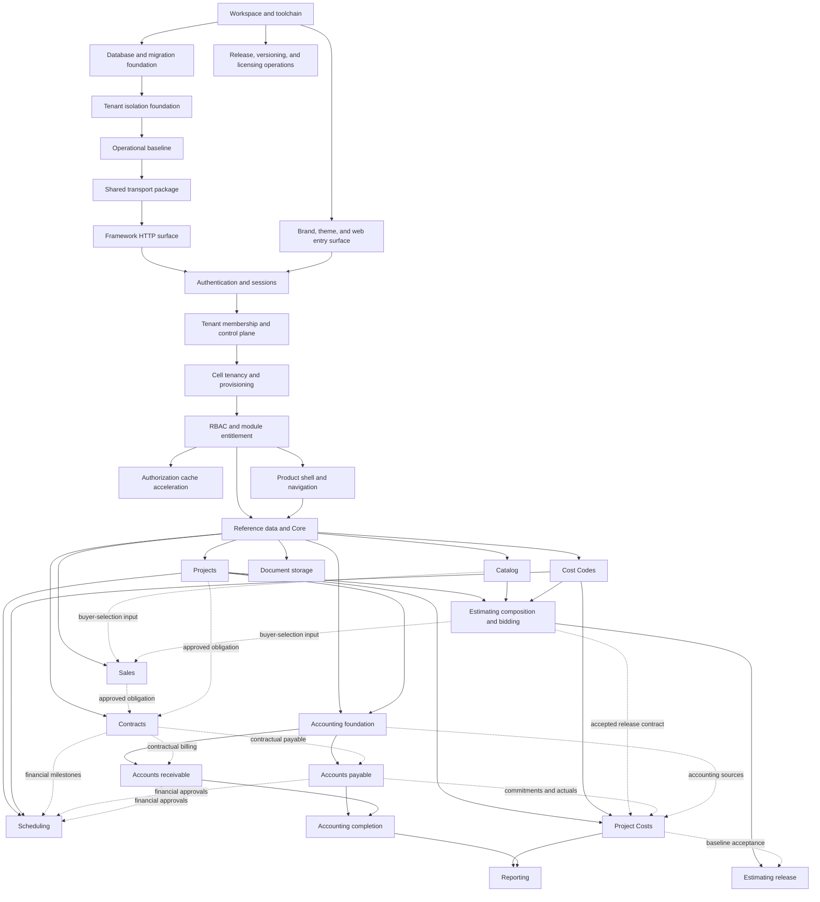

# NAP development roadmap

**Status:** Current integrated planning sequence

**Date:** 2026-09-05

**Requirements and structure:** [NAP Platform Specification](../specs/nap-platform-specification.md)

## Purpose

This is the only delivery roadmap for database, API, shared contracts, web,
operations, documentation, and tests. It records order, dependencies, status,
implementation slices, acceptance gates, and known gaps. It does not define
behavior or architecture.

Before implementation, each capability needs an accepted component PRD and any
ADRs or RULES documents that capability actually requires. Component designs
remain unaccepted: the repository holds the specification,
[ADR 0001](../ADRs/0001-project-workflow-module-boundaries.md), contributor
guidance, and repository configuration. Workspace startup scaffolds and toolchain checks are implemented; no component
PRD or RULES document exists.

## Capability record

Each capability entry records:

- user or operational outcome and dependencies;
- separate design and implementation status;
- owning PRD, ADRs, and RULES once they exist;
- required database, API, shared-contract, web, operations, and documentation
  work;
- one-concept pull-request slices;
- tests and acceptance gates; and
- open design questions or implementation gaps.

Unknown work remains explicit. A roadmap item does not invent a module contract
before its design discussion.

## Delivery rules

- Use one coherent vertical concept per pull request; it may span database,
  API, shared contracts, web, tests, and documentation.
- Keep every intermediate merge deployable, all checks green, migrations
  backward-compatible, and incomplete behavior unreachable.
- Test positive behavior, denial and failure paths, tenant isolation, migration
  paths, and client states applicable to each concept.
- Update affected documentation in every pull request and reconcile all current
  documents before marking a capability `Verified`.
- The specification governs. A capability that needs something it does not
  permit stops: the conflict is raised and the specification is amended before
  the PRD or the code is written.
- Every capability with client UI applies the specification's web shared
  behavior, and its component PRD defines routes, drawer use, full-page
  workflows, responsive behavior, loading, empty, denied, and error states, and
  any justified exception.

## Dependency path

Projects, Catalog, and Cost Codes follow Core and may be designed in parallel.
Estimating composition and bidding require their accepted contracts. Scheduling
requires Projects and Cost Codes; financial milestone flows wait for the
applicable Contracts, A/P, or A/R contracts. Design Estimating release and
Project Costs baseline acceptance together before implementing release;
composition and bidding can proceed independently. Commitment and actual-cost
tracking waits for the A/P and accounting sources it consumes.

Contracts foundation may begin after Core; each source-specific agreement flow
waits for the applicable source PRD. Sales buyer-selection integration waits
for the Catalog and Estimating contracts it consumes.

## Product-area implementation map

Product areas group delivery for planning and navigation. The
[product-area map](../specs/nap-platform-specification.md#product-area-map)
owns their relationship to modules and assigns no table ownership; component
PRDs define exact tables, endpoints, permissions, screens, and workflows when
each feature is discussed. Product areas in the same delivery wave may proceed
in parallel once their dependencies are satisfied.

| Delivery wave | Product area  | Depends on                                                                                         | Expected API responsibility                                                                     | Expected web area                                         |
| ------------- | ------------- | -------------------------------------------------------------------------------------------------- | ----------------------------------------------------------------------------------------------- | --------------------------------------------------------- |
| 0             | Platform      | —                                                                                                  | Handles, migrations, isolation, operations, transport, and `framework/`                         | Branded entry surface only                                |
| 1             | Auth          | Platform foundation                                                                                | Login and sessions now; later entitlement and RBAC decisions                                    | Login and account now; later denied and permission states |
| 2             | Admin         | Authentication                                                                                     | Tenant, user, membership, cell, provisioning, and operator work                                 | Tenant and user management and provisioning status        |
| 3             | Core          | Admin and RBAC                                                                                     | Shared references, core party records, contact methods, settings, catalogs                      | Shared master-data and settings workflows                 |
| 4             | Projects      | Core; schedules also need Cost Codes; cost and financial flows need their source capabilities      | Projects and components; Scheduling, Project Costs, A/P, and Contracts integration as available | Project tree, schedules, changes, POs, and cost tracking  |
| 5             | Estimating    | Projects, Catalog, Cost Codes; release also needs Project Costs baseline acceptance                | Templates, composition, bids, approval, and release                                             | Estimate composition, bidding, review, and release        |
| 6             | Budgets       | Projects, Cost Codes, Estimating release contract; commitments and actuals need A/P and accounting | Approved baselines, cost changes, source references, forecasts, and variances                   | Baseline, commitment, actual-cost, and variance workflows |
| 7             | Sales         | Core; integrations also need their source                                                          | Opportunities, quotes, buyer selections, and approvals                                          | Sales pipeline, quote, selection, and approval            |
| 7             | Accounting    | Core and Projects                                                                                  | Ledgers, journals, periods, posting, balances, and close                                        | Accounting setup, journals, posting, and close            |
| 8             | Contracts     | Core; source flows need their source capability                                                    | Agreements, immutable snapshots, amendments, milestones, and events                             | Agreement, amendment, milestone, and history workflows    |
| 9             | A/P           | Accounting, Core, and applicable Contracts                                                         | Purchase orders, vendor invoices, payment approvals, payments, allocations, and credits         | Purchasing, payables approval, payment, and inquiry       |
| 9             | A/R           | Accounting, Core, Projects, applicable Contracts                                                   | Billing, invoices, receipts, allocations, and credits                                           | Receivables entry, billing, receipt, and inquiry          |
| 10            | Reporting     | Each accepted source capability                                                                    | Tenant-safe queries, exports, and reconciliation                                                | Reports, filters, drill-through, and export               |
| —             | Notifications | Auth plus the source capability                                                                    | Event delivery and delivery status                                                              | Preferences, delivery status, and source-linked actions   |

Delivery waves mark the first usable scope of each area; later integrations
wait for their source capabilities. Catalog materials, assemblies, pricing, and
matching support Core and Estimating. Cost Codes follows Core and supports
Estimating, Scheduling, and Project Costs under `ARCH-041`. The future settings
capability chooses its technical owner during design. Notifications is not a
prerequisite phase: its design starts when the first source capability has an
accepted notification need.

## Current delivery board

Workspace and toolchain implements specification-owned architecture; its local
checks and passing CI are recorded in [PR #1](https://github.com/silverstone-i/nap/pull/1). Component capabilities still
start from the specification and applicable ADRs.

| Capability                                    | Design   | Implementation | Depends on                                                                                         |
| --------------------------------------------- | -------- | -------------- | -------------------------------------------------------------------------------------------------- |
| Workspace and toolchain                       | Accepted | Verified       | —                                                                                                  |
| Database and migration foundation             | Draft    | Not started    | Workspace and toolchain                                                                            |
| Tenant isolation foundation                   | Draft    | Not started    | Database foundation                                                                                |
| Operational baseline                          | Draft    | Not started    | Tenant isolation foundation                                                                        |
| Shared transport package                      | Draft    | Not started    | Operational baseline                                                                               |
| Framework HTTP surface                        | Draft    | Not started    | Shared transport package                                                                           |
| Brand, theme, and web entry surface           | Draft    | Not started    | Workspace and toolchain                                                                            |
| Release, versioning, and licensing operations | Draft    | Not started    | Workspace and toolchain                                                                            |
| Authentication and sessions                   | Draft    | Not started    | Framework HTTP surface; web entry                                                                  |
| Tenant membership and control plane           | Draft    | Not started    | Authentication                                                                                     |
| Cell tenancy and provisioning                 | Draft    | Not started    | Tenant control plane                                                                               |
| RBAC and module entitlement                   | Draft    | Not started    | Cell provisioning                                                                                  |
| Authorization cache acceleration              | Draft    | Not started    | RBAC and module entitlement                                                                        |
| Product shell and navigation                  | Draft    | Not started    | RBAC; first tenant-aware module                                                                    |
| Reference data and Core                       | Draft    | Not started    | RBAC                                                                                               |
| Document storage                              | Draft    | Not started    | Core; first module storing a document                                                              |
| Projects                                      | Draft    | Not started    | Core                                                                                               |
| Cost Codes                                    | Draft    | Not started    | Core                                                                                               |
| Catalog                                       | Draft    | Not started    | Core                                                                                               |
| Estimating                                    | Draft    | Not started    | Projects, Catalog, Cost Codes; release needs Project Costs baseline contract                       |
| Scheduling                                    | Draft    | Not started    | Projects, Cost Codes; financial flows need applicable Contracts, A/P, or A/R                       |
| Project Costs                                 | Draft    | Not started    | Projects, Cost Codes, Estimating release contract; commitments and actuals need A/P and accounting |
| Sales                                         | Draft    | Not started    | Core; integration sources                                                                          |
| Contracts                                     | Draft    | Not started    | Core; agreement sources                                                                            |
| Accounting foundation                         | Draft    | Not started    | Core and Projects                                                                                  |
| Accounts payable                              | Draft    | Not started    | Accounting, Core, Contracts                                                                        |
| Accounts receivable                           | Draft    | Not started    | Accounting, Core, Projects, Contracts                                                              |
| Accounting completion                         | Draft    | Not started    | A/P and A/R                                                                                        |
| Reporting                                     | Draft    | Not started    | Each report's source module                                                                        |
| Notifications                                 | Draft    | Not started    | First accepted source need                                                                         |
| Operational scale units                       | Draft    | Not started    | Measured operational need                                                                          |

## Platform foundation

The foundation is the specification's architecture rather than a product
feature, so it needs no component PRD. It needs the ADRs and RULES documents
its own work actually requires, and each capability below is one or more
one-concept pull requests.

### Workspace and toolchain

**Outcome:** Independently buildable `apps/api`, `apps/web`, and
`packages/shared` workspaces on the specification's stack, with every
repository check running green.

**Design:** Accepted (specification-owned). **Implementation:** Verified in [PR #1](https://github.com/silverstone-i/nap/pull/1); merge pending.

**Depends on:** Nothing.

**Documents:** The specification's
[technology stack](../specs/nap-platform-specification.md#technology-stack) and
[repository structure](../specs/nap-platform-specification.md#repository-structure),
`ARCH-001`–`ARCH-003`, `ARCH-051`.

**Required surfaces:** Root and per-workspace manifests, the lockfile,
TypeScript project references, ESLint and Prettier configuration, the Vitest
setup for each workspace, and the `lint`, `format:check`, `typecheck`, `test`,
`build`, `licenses`, `dev:api`, and `dev:web` scripts the existing CI workflow
and contributor guidance already name.

**Current state:** Independent API, web, and shared builds, development entry
points, strict TypeScript configurations, Vitest suites, import-boundary checks,
license checking, and the npm lockfile are implemented. Development/test database
setup provisions missing databases and least-privileged runtime roles for the
existing CI gate. Migrations, application tables, runtime database handles, and
startup role assertions remain in Database and migration foundation.

**Plan:** [Workspace and toolchain](../implementation-plans/workspace-and-toolchain.md).

**Evidence:** [Passing CI](https://github.com/silverstone-i/nap/actions/runs/33993431984)
verifies clean installation, database setup, all repository checks, and 29 tests.
Local checks additionally verified independent builds with generated output
removed, browser rendering and hot reload, and API watch restart.

**Gate:** Both applications build and start independently, the shared package
builds, every check command runs green locally and in CI, and no workspace
imports another except through its published entry point.

### Database and migration foundation

**Outcome:** Separate admin and cell handles, explicit migration targets, least-
privileged runtime roles, and a startup assertion that refuses a connection
able to bypass row-level security.

**Design:** Draft. **Implementation:** Not started.

**Depends on:** Workspace and toolchain.

**Documents:** `ARCH-004`–`ARCH-010`, `ARCH-019`, `ARCH-024`–`ARCH-026`,
`ARCH-036`, `ARCH-049`, and the specification's database composition roots.

**Required surfaces:** `util/env.ts`, `db/admin/`, `db/cell/`,
`db/assertRuntimeRole.ts`, the two migration runners, the module registries as
composition roots, and the canonical `CELL_SCHEMAS` ordering. The roles
`nap_admin` and `nap_app` and the database setup script the CI workflow already
expects.

**Gate:** Each handle migrates, connects, and closes independently; a runtime
role holding `SUPERUSER`, `BYPASSRLS`, table ownership, or a membership path to
one fails startup; cell migrations run `cell`, `reference`, `app`, then
`reporting` regardless of registration order; a fresh build and an upgrade path
produce identical schemas.

### Tenant isolation foundation

**Outcome:** Tenant-owned data is unreachable across tenants even when an
application predicate is omitted.

**Design:** Draft. **Implementation:** Not started.

**Depends on:** Database and migration foundation.

**Documents:** `ARCH-013`–`ARCH-021`, `ARCH-033`, `ARCH-037`, `ARCH-044`, and
the specification's tenant transaction contract.

**Required surfaces:** `withTenantTransaction.ts`, the shared isolation harness
at `apps/api/tests/fixtures/tenantIsolationHarness.ts`, and the
`isolation_probe` fixture table with its RLS `USING` and `WITH CHECK` policies,
registered by the isolation suite and never by the cell module registry.

**Gate:** Negative tests fail every attempted cross-tenant read, insert, update,
delete, and foreign-key reference; operation with no tenant context and with an
invalid one returns empty rather than erroring; the tenant value is rejected
from body, query, route parameter, and header.

### Operational baseline

**Outcome:** Requests carry a correlation identifier, logs are structured and
redacted, the API has liveness and readiness, and failures reach the client
through the shared envelope.

**Design:** Draft. **Implementation:** Not started.

**Depends on:** Tenant isolation foundation.

**Documents:** `ARCH-045` and the specification's operational standards.

**Required surfaces:** `util/requestContext.ts`, correlation middleware ahead of
the body parser, the logging adapter for both database handles, the process
lifecycle — configuration, startup ordering, bounded readiness, graceful
shutdown — and the boundary error handler.

**Settled:** The specification names the logger, its output, and the owner of
the error-code registry. Sampling policy remains unnamed.

**Gate:** Correlation propagation, safe error mapping, redaction, audit
separation, bounded retry behavior, safe health responses, and low-cardinality
metrics pass their tests, and no unknown path, malformed body, oversized body,
or unmapped fault escapes the envelope.

### Shared transport package

**Outcome:** `@nap/shared` carries the runtime validation schemas and inferred
types both sides of the API boundary use.

**Design:** Draft. **Implementation:** Not started.

**Depends on:** Operational baseline.

**Documents:** `ARCH-043` and the specification's shared package boundary.

**Required surfaces:** `transport/errors.ts` with the `apiErrorSchema` envelope
— `version`, `code`, `message`, optional `fieldErrors` — the matching success
envelope the framework contract requires, the error-code registry, one folder
per domain group, and one export line per folder in the root index.

**Gate:** Request and response validation runs at the API boundary and in the
client, and the package imports no API domain, persistence, configuration, or
component code.

### Framework HTTP surface

**Outcome:** Every module presents the same routes, middleware order,
parameters, responses, and refusals without writing a handler.

**Design:** Draft. **Implementation:** Not started.

**Depends on:** Shared transport package.

**Documents:** `ARCH-050` and the specification's
[framework HTTP contract](../specs/nap-platform-specification.md#framework-http-contract).

**Required surfaces:** `framework/ReadController.ts`,
`framework/WriteController.ts`, `framework/createRouter.ts`, the route registry
as a composition root, the ordered middleware chain, list parameter parsing,
the multipart parser behind the spreadsheet routes, and the extension callback.

**Blocked:** The specification's technology stack names no multipart parser.
This capability cannot start until it does, or until the spreadsheet routes
leave the standard route set.

**Gate:** A conformance test proves every module router is produced by the
factory, no controller reaches a database handle outside
`withTenantTransaction`, a disabled route is indistinguishable from an
unregistered one, an unknown filter column is rejected, and a batch write
refuses all-or-nothing while naming the refused identifiers.

### Brand, theme, and web entry surface

**Outcome:** Brand tokens, theme mode, the shared style surface, the wordmark,
the route-level error boundary, and a branded holding entry exist before any
product screen does.

**Design:** Draft. **Implementation:** Not started.

**Depends on:** Workspace and toolchain.

**Documents:** [`BRAND.md`](../branding/BRAND.md) as the owner of token values
and visual specifications, `ARCH-001`, `ARCH-003`, and the specification's web
structure and web shared behavior.

**Constraint:** This capability establishes no product navigation, tenant URL
vocabulary, or shell layer. The first tenant-aware product module accepts those.

**Gate:** No component contains a hex literal, gold appears only in its approved
placements, the `system | light | dark` preference persists and follows
`prefers-color-scheme`, and the error boundary renders with retry.

### Release, versioning, and licensing operations

**Outcome:** The release contract, version source, changelog promotion, tag and
GitHub Release behavior, and the production-license allowlist have an accepted
owning PRD rather than only contributor guidance.

**Design:** Draft. **Implementation:** Not started.

**Depends on:** Workspace and toolchain, because every workflow step runs an npm
script that does not exist yet.

**Current state:** `ci.yml`, `changelog-check.yml`, `release-on-merge.yml`, the
`commit-msg` hook, and `.licenses-allowed.json` are checked in. The license
check script they invoke is not.

**Gate:** A labelled pull request bumps, promotes the changelog, tags, and
publishes exactly once; an unlabelled one does none of it; a production
dependency with a disallowed license fails the check.

## Identity and central control plane

### Authentication and sessions

**Outcome:** A portal user authenticates against central authority and receives
a revocable, database-backed session.

**Design:** Draft. **Implementation:** Not started.

**Depends on:** Framework HTTP surface, and the web entry surface for its
routes.

**Required design:** A PRD for the `admin-tenancy` module covering portal
identities, credential storage, session lifetime and revocation, login
throttling, logout, and password reset. The session and identity resolution
that middleware needs is a service under `ARCH-048`, not part of the module.

**Required surfaces:** Admin identity, credential, and session migrations;
repositories, the session service, session middleware, and the module's
versioned auth routes; shared transport contracts; login, logout, session, and
password web flows.

**Gate:** A revoked session, an expired session, a throttled login, and a
tampered cookie are all refused; the resolved actor and tenant come from the
database on every request; import-boundary tests prove middleware imports no
module.

### Tenant membership and control plane

**Outcome:** A portal identity can list current memberships, select one active
tenant, and never select a cell or database.

**Design:** Draft. **Implementation:** Not started.

**Depends on:** Authentication and sessions.

**Required design:** PRDs for the tenant registry, membership, cell registry
and assignment, and controlled administration. The membership model supports
multiple tenants for every portal identity. Application guards allow ordinary
employee and client users one active tenant membership and allow vendor users
several. Centrally authorized `package_admin` and `support` users may be
granted access to or impersonation of any tenant without ordinary memberships
in every tenant, but every tenant-data request still resolves one target
tenant. Controlled administration owns the audit path; RBAC assigns the exact
platform-role permissions.

**Gate:** A second ordinary employee or client tenant membership is rejected;
vendor multi-tenant memberships work with one active tenant at a time;
unauthorized platform access is denied; authorized platform access or
impersonation records its audit and resolves one target tenant to its one
active cell assignment; revocation and stale state cannot increase access.

## Cell tenancy and provisioning

### Enforcement projections and tenant activation

**Outcome:** A pending tenant becomes active only after the assigned cell has
confirmed its tenant and membership projections, seed configuration, and
negative isolation proof.

**Design:** Draft. **Implementation:** Not started.

**Depends on:** Tenant membership and control plane.

**Required design:** `cell-tenancy` targets the `cell` database and `cell`
schema, exposes no API routes, is written only by the provisioning and
synchronization service, and receives no PRD of its own; its projection tables
are documented inside the `admin-tenancy` PRD.

**Required surfaces:** Central workflow state, cell projections, idempotent
synchronization and recovery services, tenant-selection middleware, one real
web tenant-switch flow, operator status, and second-cell deployment tests.

**Gate:** Login, tenant selection, authoritative routing, a tenant-scoped cell
read, cross-tenant denial, recoverable partial provisioning, and stable client
addressing pass with the same build in two cells.

## Access control

### RBAC and module entitlement

**Outcome:** Generic middleware authorizes a registered endpoint for the current
actor and active tenant before module code runs.

**Design:** Draft. **Implementation:** Not started.

**Depends on:** Cell tenancy and tenant activation.

**Required design:** PRDs for RBAC, module entitlement, and only the approval,
numbering, preference, state-scope, or field-scope capabilities the first
business release needs. Their tables belong to `core`; the request-time decision
is a service. This capability also decides whether the module descriptor gains a
`licensable` field, and it assigns the exact permissions for `package_admin` and
`support`, including tenant selection, access, impersonation, reason capture,
and audit review.

**Gate:** Allowed, denied, disabled, revoked, and stale-state cases pass through
both API and web states. Platform-role tests prove privileged tenant access
requires an assigned permission, resolves one target tenant per request, and
records the controlled audit. Registry consistency and import-boundary tests
pass.

### Authorization cache acceleration

**Outcome:** Session, routing, and authorization lookups stop reaching the
database on every request.

**Design:** Draft. **Implementation:** Not started.

**Depends on:** RBAC and module entitlement, working against PostgreSQL alone.

**Documents:** `ARCH-023`, `ARCH-029`.

**Required design:** What is cached, its key shape and lifetime, and which
writes invalidate which entries. The cache is added in front of a proven path
and never becomes the decision.

**Gate:** With Redis stopped, every authorization outcome is unchanged and only
latency differs. A membership revocation, role change, or tenant suspension is
reflected on the next request. No security state exists only in Redis.

## Web client

### Product shell and navigation

**Outcome:** An authenticated, tenant-aware application frame with
authorization-aware navigation and one shared reader for URL-derived scope.

**Design:** Draft. **Implementation:** Not started.

**Depends on:** RBAC and module entitlement, and the first tenant-aware product
module, which accepts and establishes it.

**Required design:** The tenant, company, and project route vocabulary; the rail
and overlay navigation behavior; module lazy boundaries; and the normalized
scope reader that treats a resource outside the active tenant as unset.

**Gate:** Navigation lists only implemented, entitled, permitted modules;
back and forward replay module, resource, filter, drawer, and tab state; a
denied or revoked state renders intentionally; hiding navigation grants nothing
the API would refuse.

## Reference data and Core

### Shared references and company and party records

**Outcome:** Provide the companies, vendors, clients, employees, contacts,
payment terms, tax identifiers, and reference values Projects, Catalog, and
Accounting require.

**Design:** Draft. **Implementation:** Not started.

**Depends on:** RBAC and module entitlement.

**Required design:** Accept capability PRDs in dependency order. A company
belongs to one tenant; do not introduce a generic business `entity` model. The
owning modules are `reference-data` and `core`, and `core` also holds the roles,
permissions, scopes, approvals, numbering, and preference tables; the
authorization decision itself is a service (`ARCH-048`).

**Gate:** The real API and web client satisfy each accepted contract, shared
reference writes are controlled, tenant relationships pass composite-key and RLS
tests, and downstream modules do not invent a second party owner.

## Document storage

### Binary documents and their metadata

**Outcome:** A module can store, authorize, and retrieve a binary document
without putting its bytes in PostgreSQL.

**Design:** Draft. **Implementation:** Not started.

**Depends on:** Core, and the first module that stores a document.

**Documents:** `ARCH-030` and the specification's technology stack.

**Required design:** The storage service and its key shape, the metadata a
module records, upload and download authorization, time-limited access, size
and type limits, integrity verification, and retention.

**Gate:** No module, page, or migration imports the storage SDK; a client never
receives a durable storage address; a document is reachable only through the
tenant boundary that owns its metadata row.

## Projects

### Project and Project Component hierarchy

**Outcome:** A company can own projects whose work is represented by a recursive
Project Component tree.

**Design:** Draft. **Implementation:** Not started.

**Depends on:** Core.

**Required design:** The smallest project lifecycle, recursive parent model,
cycle rejection, tenant-configured component types and allowed relationships,
progressive tree loading, permissions, memberships, and operational change
control. Follow the ownership boundaries in `ARCH-041` and `ARCH-046`.

**UI:** If Projects is the first tenant-aware product module, it also accepts
and establishes the product shell.

**Gate:** A permitted user operates a project and nested components through the
real API and web client; ownership, cycle, tenant, permission, state, loading,
and relationship failures are tested.

## Cost Codes

### Shared cost classification

**Outcome:** Estimating, Scheduling, and Project Costs use a common classification
vocabulary under `ARCH-041`.

**Design:** Draft. **Implementation:** Not started.

**Depends on:** Core.

**Required design:** Category and activity definitions, valid combinations,
versioning, retirement, permissions, and references from consuming modules.

**Gate:** Consumers reuse the same definitions; invalid combinations and
cross-tenant references are rejected without breaking historical records.

## Catalog

### Materials, assemblies, vendor pricing, and matching

**Outcome:** Provide reusable materials and assemblies with vendor pricing and
matching under `ARCH-041`.

**Design:** Draft. **Implementation:** Not started.

**Depends on:** Core and the reference values selected during design. External
providers wait for an accepted component design.

**Required design:** Material identity, units, material-only assemblies, nested
components, quantity precision, cycle prevention, versioning, substitution,
vendor SKUs, pricing, and matching.

**Gate:** Assemblies calculate accepted quantities, reject cycles and
cross-tenant references, and expose runtime-validated contracts to Estimating.
Matching is explainable and review decisions are append-only.

## Estimating

### Estimate composition, bidding, and release

**Outcome:** Compose and approve estimates for release under `ARCH-041`.

**Design:** Draft. **Implementation:** Not started.

**Depends on:** Accepted and implemented Projects, Catalog, Cost Codes, and
required Core contracts. Production release also requires the Project Costs
baseline contract; this does not block estimate composition and bidding.

**Required design:** Templates, versions, cost inputs, quantities, material/labor
treatment, bids and revisions, approval, release snapshots, rounding, and rollup
rules. Manufacturing production workflow remains outside this module.

**Gate:** Mixed BOM and turnkey examples reconcile at component and project
levels. Release preserves approved estimate history and establishes the accepted
baseline without duplicate effects; version, approval, tenant, and permission
checks pass through API and web.

## Scheduling

### Project and work-unit production schedules

**Outcome:** Schedule and track project work under `ARCH-041` while preserving
the contractual milestone boundary in `ARCH-046`.

**Design:** Draft. **Implementation:** Not started.

**Depends on:** Projects, Cost Codes, and required Core contracts. Financial
milestone flows additionally require their Contracts, A/P, or A/R contracts.

**Required design:** Activity occurrences, dependencies, milestones, gates,
deliverables, completion, and work-unit schedules; acceptance and downstream
approval handoffs for the first supported workflow.

**Gate:** Schedules reuse activity definitions, respect dependencies and gates,
and preserve distinct operational completion and financial approval records.

## Project Costs

### Released baselines, cost changes, and reconciliation

**Outcome:** Track production costs against the released baseline under
`ARCH-041`.

**Design:** Draft. **Implementation:** Not started.

**Depends on:** Projects, Cost Codes, and the accepted Estimating release
contract. Commitment and actual-cost tracking additionally require A/P and the
accounting source contracts they consume.

**Required design:** Baseline creation, approved changes, source references,
rollups, forecasts, variance, reconciliation, and replay-safe handoffs. Design
Estimating release and baseline acceptance together before implementing release.

**Gate:** Release and approved changes preserve history; commitments and actuals
reconcile to source transactions without duplicating their ownership or counting
the same cost twice.

## Sales

### Opportunities, quotes, and buyer selections

**Outcome:** Manage mutable opportunities, quotes, buyer selections, and their
approval workflows before a binding agreement is executed.

**Design:** Draft. **Implementation:** Not started.

**Depends on:** Core. Catalog and Estimating are required only for
the Sales workflows that consume their accepted contracts.

**Required design:** The smallest opportunity, quote, selection, and approval
lifecycle; source-data references; pricing provenance; permissions; and the
handoff that creates a Contracts-owned immutable snapshot. Sales does not own
executed agreements or duplicate its source modules' records.

**Gate:** Approved Sales work creates the accepted Contracts input without
mutating source history, and rejected, stale, cross-tenant, and unauthorized
handoffs fail through the real API and web client.

## Contracts

### Binding agreements, amendments, and milestones

**Outcome:** Preserve executed customer, vendor, subcontract, land-purchase, and
other binding agreements independently of the workflow that originated or
fulfills them.

**Design:** Draft. **Implementation:** Not started.

**Depends on:** Core. A source-specific agreement flow also depends on its
accepted source capability; generic agreement origination does not depend on
Sales.

**Required design:** Agreement types, counterparties, execution and signature
rules, immutable scope and pricing snapshots, versions, amendments, contractual
change orders, milestones, permissions, audit history, and auditable
domain-event contracts. Projects retains operational change control, and source
modules retain their mutable working records.

**Gate:** Execution and amendment preserve immutable history; milestone events
are auditable and replay-safe; and A/R, A/P, or another consumer makes an
idempotent decision before creating its own downstream record.

## Accounting

### Accounting foundation

**Outcome:** Provide ledgers, chart of accounts, periods, journals, posting,
balances, and reversal before a subledger posts.

**Design:** Draft. **Implementation:** Not started.

**Depends on:** Core and Projects; Estimating only where an accepted posting
contract requires it.

**Gate:** Balanced entries post atomically, closed periods reject posting,
corrections preserve history, and retries do not duplicate financial effects.

### Accounts payable

**Outcome:** Process purchase orders, vendor invoices, approvals, payments,
allocations, and credits through their accounting effects under `ARCH-041`
and `ARCH-046`.

**Design:** Draft. **Implementation:** Not started.

**Depends on:** Accounting foundation and required Core capabilities.
Contract-driven payables also require the applicable Contracts capability.

**Gate:** The first A/P scenario passes end to end through the real web client,
including duplicate, approval, reversal, settlement, and isolation tests.

### Accounts receivable

**Outcome:** Process invoices, receipts, allocations, credits, and project
billing through their accounting effects.

**Design:** Draft. **Implementation:** Not started.

**Depends on:** Accounting foundation and required Core and Projects
capabilities. Contract-driven billing also requires the applicable Contracts
capability.

**Gate:** The first A/R scenario passes end to end through the real web client,
including reversal and isolation tests.

### Accounting completion

**Outcome:** Add evidenced multi-company, consolidation, intercompany, and
advanced-close capabilities.

**Design:** Draft. **Implementation:** Not started.

**Depends on:** A/P and A/R evidence.

**Gate:** Cross-company behavior balances, reconciles, audits, and reverses
without assuming cross-database atomicity.

## Reporting

### Tenant-safe reports

**Outcome:** Provide authorized reports, drill-through, export, and
reconciliation for accepted source modules.

**Design:** Draft. **Implementation:** Not started.

**Depends on:** Each report's source capability.

**Required design:** One PRD per reporting capability, including freshness,
authorization, drill-through, export, background refresh, and reconciliation.

**Gate:** Reports reconcile to source transactions, and views, exports,
refreshes, and workers preserve active-tenant and permission scope.

## Notifications

### Source-driven delivery

**Outcome:** Deliver accepted business or operational events without moving
event ownership out of the source module.

**Design:** Draft. **Implementation:** Not started.

**Depends on:** Authentication and the first source capability with an accepted
notification requirement.

**Required design:** The first source PRD defines when its event exists. A
Notifications PRD then defines channels, recipient resolution, preferences,
delivery state, retries, templates, privacy, and failure behavior needed for
that event. Do not build a generic notification platform before that need.

**Gate:** The source event and its delivery are authorized, tenant-scoped,
idempotent, observable, and testable through the real API and web client.

## Operational scale units

### Cells, workers, caches, storage, and tenant movement

**Outcome:** Add operational units only when measured capacity, isolation,
regional, residency, recovery, or workload evidence requires them.

**Design:** Draft. **Implementation:** Not started.

**Depends on:** The capability creating the operational need.

**Required design:** An accepted PRD, and an ADR where a decision the
specification leaves open is made. This staged operational work requires an
implementation plan covering observability, compatibility, backup, restore,
cutover, and recovery; create the plan as the first step of implementation.

**Gate:** Recovery, compatibility, observability, and negative-isolation
exercises pass before the new pattern carries production traffic.

## Capability completion gate

A capability becomes `Verified` only when:

1. Its accepted PRD success criteria pass.
2. Applicable specification conformance entries continue to pass.
3. Every implementation pull request has merged with green repository checks.
4. Fresh and upgrade migration paths and rollback or recovery procedures pass.
5. Positive, denial, failure, and tenant-isolation tests cover the accepted
   behavior.
6. Required UI states and real transport validation pass.
7. Operational evidence exists for new deployment or background units.
8. The final documentation reconciliation matches merged code and migrations.

Capabilities describe dependencies, not fixed releases. A release may contain an
independently deployable vertical slice whose incomplete remainder stays
inaccessible and whose status remains below `Verified`.
