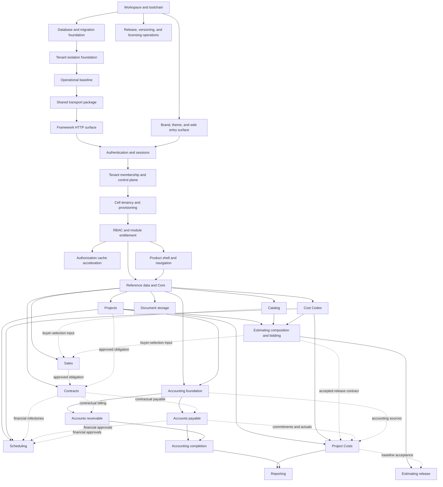

# NAP development roadmap

**Status:** Current integrated planning sequence

**Date:** 2026-09-05

**Requirements and structure:** [NAP Platform Specification](../specs/nap-platform-specification.md)

## Purpose

This is the only delivery roadmap for database, API, shared contracts, web,
operations, documentation, and tests. It records order, dependencies, status,
implementation slices, acceptance gates, and known gaps. It does not define
behavior or architecture.

Before implementation, each capability needs an accepted component PRD and any
ADRs or RULES documents that capability actually requires. Remaining component designs
await acceptance: the repository holds the specification,
[accepted ADRs](../ADRs/INDEX.md), contributor
guidance, and repository configuration. Workspace startup scaffolds, toolchain
checks, the database/migration foundation, the tenant isolation foundation, the
operational baseline, the shared transport package, and the framework HTTP
surface are implemented; component PRDs are listed in the documentation index. [JavaScript-first TypeScript](../RULES/javascript-first-typescript.md)
owns the shared coding convention.

## Capability record

Each capability entry records:

- user or operational outcome and dependencies;
- separate design and implementation status;
- owning PRD, ADRs, and RULES once they exist;
- required database, API, shared-contract, web, operations, and documentation
  work;
- one-concept pull-request slices;
- tests and acceptance gates; and
- open design questions or implementation gaps.

Unknown work remains explicit. A roadmap item does not invent a module contract
before its design discussion.

## Delivery rules

- Use one coherent vertical concept per pull request; it may span database,
  API, shared contracts, web, tests, and documentation.
- Keep every intermediate merge deployable, all checks green, migrations
  backward-compatible, and incomplete behavior unreachable.
- Test positive behavior, denial and failure paths, tenant isolation, migration
  paths, and client states applicable to each concept.
- Update affected documentation in every pull request and reconcile all current
  documents before marking a capability `Verified`.
- The specification governs. A capability that needs something it does not
  permit stops: the conflict is raised and the specification is amended before
  the PRD or the code is written.
- Every capability with client UI applies the specification's web shared
  behavior, and its component PRD defines routes, drawer use, full-page
  workflows, responsive behavior, loading, empty, denied, and error states, and
  any justified exception.

## Dependency path

Projects, Catalog, and Cost Codes follow Core and may be designed in parallel.
Estimating composition and bidding require their accepted contracts. Scheduling
requires Projects and Cost Codes; financial milestone flows wait for the
applicable Contracts, A/P, or A/R contracts. Design Estimating release and
Project Costs baseline acceptance together before implementing release;
composition and bidding can proceed independently. Commitment and actual-cost
tracking waits for the A/P and accounting sources it consumes.

Contracts foundation may begin after Core; each source-specific agreement flow
waits for the applicable source PRD. Sales buyer-selection integration waits
for the Catalog and Estimating contracts it consumes.

## Product-area implementation map

Product areas group delivery for planning and navigation. The
[product-area map](../specs/nap-platform-specification.md#product-area-map)
owns their relationship to modules and assigns no table ownership; component
PRDs define exact tables, endpoints, permissions, screens, and workflows when
each feature is discussed. Product areas in the same delivery wave may proceed
in parallel once their dependencies are satisfied.

| Delivery wave | Product area  | Depends on                                                                                         | Expected API responsibility                                                                     | Expected web area                                         |
| ------------- | ------------- | -------------------------------------------------------------------------------------------------- | ----------------------------------------------------------------------------------------------- | --------------------------------------------------------- |
| 0             | Platform      | —                                                                                                  | Handles, migrations, isolation, operations, transport, and `framework/`                         | Branded entry surface only                                |
| 1             | Auth          | Platform foundation                                                                                | Login and sessions now; later entitlement and RBAC decisions                                    | Login and account now; later denied and permission states |
| 2             | Admin         | Authentication                                                                                     | Tenant, user, membership, cell, provisioning, and operator work                                 | Tenant and user management and provisioning status        |
| 3             | Core          | Admin and RBAC                                                                                     | Shared references, core party records, contact methods, settings, catalogs                      | Shared master-data and settings workflows                 |
| 4             | Projects      | Core; schedules also need Cost Codes; cost and financial flows need their source capabilities      | Projects and components; Scheduling, Project Costs, A/P, and Contracts integration as available | Project tree, schedules, changes, POs, and cost tracking  |
| 5             | Estimating    | Projects, Catalog, Cost Codes; release also needs Project Costs baseline acceptance                | Templates, composition, bids, approval, and release                                             | Estimate composition, bidding, review, and release        |
| 6             | Budgets       | Projects, Cost Codes, Estimating release contract; commitments and actuals need A/P and accounting | Approved baselines, cost changes, source references, forecasts, and variances                   | Baseline, commitment, actual-cost, and variance workflows |
| 7             | Sales         | Core; integrations also need their source                                                          | Opportunities, quotes, buyer selections, and approvals                                          | Sales pipeline, quote, selection, and approval            |
| 7             | Accounting    | Core and Projects                                                                                  | Ledgers, journals, periods, posting, balances, and close                                        | Accounting setup, journals, posting, and close            |
| 8             | Contracts     | Core; source flows need their source capability                                                    | Agreements, immutable snapshots, amendments, milestones, and events                             | Agreement, amendment, milestone, and history workflows    |
| 9             | A/P           | Accounting, Core, and applicable Contracts                                                         | Purchase orders, vendor invoices, payment approvals, payments, allocations, and credits         | Purchasing, payables approval, payment, and inquiry       |
| 9             | A/R           | Accounting, Core, Projects, applicable Contracts                                                   | Billing, invoices, receipts, allocations, and credits                                           | Receivables entry, billing, receipt, and inquiry          |
| 10            | Reporting     | Each accepted source capability                                                                    | Tenant-safe queries, exports, and reconciliation                                                | Reports, filters, drill-through, and export               |
| —             | Notifications | Auth plus the source capability                                                                    | Event delivery and delivery status                                                              | Preferences, delivery status, and source-linked actions   |

Delivery waves mark the first usable scope of each area; later integrations
wait for their source capabilities. Catalog materials, assemblies, pricing, and
matching support Core and Estimating. Cost Codes follows Core and supports
Estimating, Scheduling, and Project Costs under `ARCH-041`. The future settings
capability chooses its technical owner during design. Notifications is not a
prerequisite phase: its design starts when the first source capability has an
accepted notification need.

## Current delivery board

Workspace and toolchain implements specification-owned architecture; its local
checks and passing CI are recorded in [PR #1](https://github.com/silverstone-i/nap/pull/1). Component capabilities still
start from the specification and applicable ADRs.

| Capability                                    | Design   | Implementation | Depends on                                                                                         |
| --------------------------------------------- | -------- | -------------- | -------------------------------------------------------------------------------------------------- |
| Workspace and toolchain                       | Accepted | Verified       | —                                                                                                  |
| Database and migration foundation             | Accepted | Verified       | Workspace and toolchain                                                                            |
| Tenant isolation foundation                   | Accepted | Verified       | Database foundation                                                                                |
| Operational baseline                          | Accepted | Verified       | Tenant isolation foundation                                                                        |
| Shared transport package                      | Accepted | Verified       | Operational baseline                                                                               |
| Framework HTTP surface                        | Accepted | Verified       | Shared transport package                                                                           |
| Brand, theme, and web entry surface           | Accepted | Verified       | Workspace and toolchain                                                                            |
| Release, versioning, and licensing operations | Accepted | Verified       | Workspace and toolchain                                                                            |
| Authentication and sessions                   | Accepted | Verified       | Framework HTTP surface; web entry                                                                  |
| Tenant membership and control plane           | Accepted | Verified       | Authentication                                                                                     |
| Cell tenancy and provisioning                 | Accepted | Verified       | Tenant control plane                                                                               |
| RBAC and module entitlement                   | Accepted | Verified       | Cell provisioning                                                                                  |
| Authorization cache acceleration              | Accepted | Verified       | RBAC and module entitlement                                                                        |
| Product shell and navigation                  | Accepted | Implemented    | RBAC; tenant provisioning and Core employee identity records                                       |
| Reference data and Core                       | Draft    | Not started    | RBAC                                                                                               |
| Document storage                              | Draft    | Not started    | Core; first module storing a document                                                              |
| Projects                                      | Draft    | Not started    | Core                                                                                               |
| Cost Codes                                    | Draft    | Not started    | Core                                                                                               |
| Catalog                                       | Draft    | Not started    | Core                                                                                               |
| Estimating                                    | Draft    | Not started    | Projects, Catalog, Cost Codes; release needs Project Costs baseline contract                       |
| Scheduling                                    | Draft    | Not started    | Projects, Cost Codes; financial flows need applicable Contracts, A/P, or A/R                       |
| Project Costs                                 | Draft    | Not started    | Projects, Cost Codes, Estimating release contract; commitments and actuals need A/P and accounting |
| Sales                                         | Draft    | Not started    | Core; integration sources                                                                          |
| Contracts                                     | Draft    | Not started    | Core; agreement sources                                                                            |
| Accounting foundation                         | Draft    | Not started    | Core and Projects                                                                                  |
| Accounts payable                              | Draft    | Not started    | Accounting, Core, Contracts                                                                        |
| Accounts receivable                           | Draft    | Not started    | Accounting, Core, Projects, Contracts                                                              |
| Accounting completion                         | Draft    | Not started    | A/P and A/R                                                                                        |
| Reporting                                     | Draft    | Not started    | Each report's source module                                                                        |
| Notifications                                 | Draft    | Not started    | First accepted source need                                                                         |
| Operational scale units                       | Draft    | Not started    | Measured operational need                                                                          |
| Dashboard                                     | Draft    | Not started    | Final planned capability; shell and implemented source modules                                     |

## Platform foundation

The foundation is the specification's architecture rather than a product
feature, so it needs no component PRD. It needs the ADRs and RULES documents
its own work actually requires, and each capability below is one or more
one-concept pull requests.

### Workspace and toolchain

**Outcome:** Independently buildable `apps/api`, `apps/web`, and
`packages/shared` workspaces on the specification's stack, with every
repository check running green.

**Design:** Accepted (specification-owned). **Implementation:** Verified in [PR #1](https://github.com/silverstone-i/nap/pull/1); merge pending.

**Depends on:** Nothing.

**Documents:** The specification's
[technology stack](../specs/nap-platform-specification.md#technology-stack) and
[repository structure](../specs/nap-platform-specification.md#repository-structure),
`ARCH-001`–`ARCH-003`, `ARCH-051`.

**Required surfaces:** Root and per-workspace manifests, the lockfile,
TypeScript project references, ESLint and Prettier configuration, the Vitest
setup for each workspace, and the `lint`, `format:check`, `typecheck`, `test`,
`build`, `licenses`, `dev:api`, and `dev:web` scripts the existing CI workflow
and contributor guidance already name.

**Current state:** Independent API, web, and shared builds, development entry
points, strict TypeScript configurations, Vitest suites, import-boundary checks,
license checking, and the npm lockfile are implemented. Development/test database
setup provisions missing databases and least-privileged runtime roles for the
existing CI gate. Migrations, application tables, runtime database handles, and
startup role assertions remain in Database and migration foundation.

**Plan:** [Workspace and toolchain](../implementation-plans/workspace-and-toolchain.md).

**Evidence:** [Passing CI](https://github.com/silverstone-i/nap/actions/runs/33993431984)
verifies clean installation, database setup, all repository checks, and 29 tests.
Local checks additionally verified independent builds with generated output
removed, browser rendering and hot reload, and API watch restart.

**Gate:** Both applications build and start independently, the shared package
builds, every check command runs green locally and in CI, and no workspace
imports another except through its published entry point.

### Database and migration foundation

**Delivery plan:** [Database and migration foundation](../implementation-plans/database-and-migration-foundation.md).

**Outcome:** Separate admin and cell handles, explicit migration targets, least-
privileged runtime roles, and a startup assertion that refuses a connection
able to bypass row-level security.

**Design:** Accepted (specification-owned). **Implementation:** Verified in [PR #3](https://github.com/silverstone-i/nap/pull/3).

**Depends on:** Workspace and toolchain.

**Documents:** `ARCH-004`–`ARCH-010`, `ARCH-019`, `ARCH-024`–`ARCH-026`,
`ARCH-036`, `ARCH-049`, and the specification's database composition roots.

**Required surfaces:** `util/env.ts`, `db/admin/`, `db/cell/`,
`db/assertRuntimeRole.ts`, the two migration runners, the module registries as
composition roots, and the canonical `CELL_SCHEMAS` ordering. The roles
`nap_admin` and `nap_app` and the database setup script the CI workflow already
expects.

**Gate:** Each handle migrates, connects, and closes independently; a runtime
role holding `SUPERUSER`, `BYPASSRLS`, table ownership, or a membership path to
one fails startup; cell migrations run `cell`, `reference`, `app`, then
`reporting` regardless of registration order; a fresh build and an upgrade path
produce identical schemas.

**Local evidence (2026-09-06):** All repository checks passed: lint,
format:check, typecheck, 54 tests, build, and licenses. Disposable PostgreSQL 18
tests verify separate pool lifecycles; elevated-role, ownership, creation-grant,
and membership rejection; startup/listener failure cleanup; explicit CLI targets;
empty-schema initialization; canonical ordering; repeatability and checksums;
fresh/upgrade schema equivalence; per-schema rollback and retry; and independent
dump/restore with fixture data. Production registries remain empty.
[Passing CI](https://github.com/silverstone-i/nap/actions/runs/34035220909)
verifies the implementation and teardown regression tests;
[PR #3](https://github.com/silverstone-i/nap/pull/3) owns review and merge evidence.

### Tenant isolation foundation

**Outcome:** Tenant-owned data is unreachable across tenants even when an
application predicate is omitted.

**Design:** Accepted (specification-owned). **Implementation:** Verified locally; CI/merge evidence pending.

**Depends on:** Database and migration foundation.

**Documents:** `ARCH-013`–`ARCH-021`, `ARCH-033`, `ARCH-037`, `ARCH-044`, and
the specification's tenant transaction contract.

**Required surfaces:** `withTenantTransaction.ts`, the shared isolation harness
at `apps/api/tests/fixtures/tenantIsolationHarness.ts`, and the
`isolation_probe` fixture table with its RLS `USING` and `WITH CHECK` policies,
registered by the isolation suite and never by the cell module registry.

**Gate:** Negative tests fail every attempted cross-tenant read, insert, update,
delete, and foreign-key reference. Reads with no/empty context or a valid UUID
with no matching tenant data return no rows; writes without matching context
are denied. Malformed UUIDs are rejected before a transaction opens. Directly
injecting malformed context into SQL is outside the empty-result guarantee.
Reporting, rollback, concurrent transactions, and pooled connection reuse
preserve isolation.

**Plan:** [Tenant isolation foundation](../implementation-plans/tenant-isolation-foundation.md).

**Evidence:** On 2026-09-06 with Node 24.19.0 and disposable PostgreSQL 18,
the helper and isolation suites passed 25 tests; the complete repository suite
passed 84 tests. `lint`, `typecheck`, `test`, `build`, `format:check`, and
`licenses` passed. The suites exercise model and direct-SQL access, reporting,
SQLSTATE-specific denials, immutable keys, rollback, concurrent tenants,
backend-PID-verified pool reuse, role safety, and production-registry exclusion.
No production tenant tables or HTTP tenant rejection routes are installed.

**HTTP dependency:** The framework HTTP surface rejects client-supplied tenant
values from body, query, route parameters, and headers on every framework route
and verifies it with test sessions; the authentication capability repeats the
verification with real sessions once authenticated routes exist.

### Operational baseline

**Outcome:** Requests carry a correlation identifier, logs are structured and
redacted, the API has liveness and readiness, and failures reach the client
through the shared envelope.

**Design:** Accepted. **Implementation:** Verified in [PR #6](https://github.com/silverstone-i/nap/pull/6).

**Depends on:** Tenant isolation foundation.

**Documents:** `ARCH-045` and the specification's operational standards.

**Required surfaces:** `util/requestContext.ts`, correlation middleware ahead of
the body parser, the logging adapter for both database handles, the process
lifecycle — configuration, startup ordering, bounded readiness, graceful
shutdown — and the boundary error handler.

**Settled:** The specification names the logger, its output, and the owner of
the error-code registry. Sampling policy remains deferred.

**Gate:** Correlation propagation, safe error mapping, redaction, audit
separation, bounded retry behavior, safe health responses, and low-cardinality
metrics pass their tests, and no unknown path, malformed body, oversized body,
or unmapped fault escapes the envelope.

**Implementation:** Correlation context, safe Pino/database adapters, minimal
shared error and health contracts, bounded JSON parsing, health probes, fresh
coalesced runtime-role checks, and bounded HTTP/pool shutdown are implemented.
[ADR 0003](../ADRs/0003-safe-database-log-messages.md) records the approved
message-safety clarification. Delivery follows the
[operational baseline plan](../implementation-plans/operational-baseline.md).

**Deferred:** Automatic retries, metrics export, and sampling have no current
consumer and are not implemented or claimed as verified. Diagnostic logging
does not replace database audit records; audit records arrive with the first
module that owns immutable events.

**Evidence:** [PR #6](https://github.com/silverstone-i/nap/pull/6) merged on
2026-09-06 with the `changelog`, `checks`, and `release` workflows passing.
Tests cover correlation reuse and replacement, concurrent context isolation,
the completion log record carrying the request ID and a fixed route name, safe
404 and health envelopes, malformed, oversized, compressed, and unsupported
bodies, single failure logging, a fault after headers commit, real PostgreSQL
readiness and isolation, and bounded socket/pool lifecycle. A 2026-09-07
reconciliation on `main` added the completion-record and committed-response
tests and re-ran lint, typecheck, test, build, format:check, and licenses on
Node 24.19.0.

### Shared transport package

**Outcome:** `@nap/shared` carries the runtime validation schemas and inferred
types both sides of the API boundary use.

**Design:** Accepted (specification-owned). **Implementation:** Verified in [PR #8](https://github.com/silverstone-i/nap/pull/8).

**Depends on:** Operational baseline.

**Documents:** `ARCH-043` and the specification's shared package boundary.

**Required surfaces:** `transport/errors.ts` with the `apiErrorSchema` envelope
— `version`, `code`, `message`, optional `fieldErrors` — the matching success
envelope the framework contract requires, the error-code registry, one folder
per domain group, and one export line per folder in the root index.

**Gate:** Request and response validation runs at the API boundary and in the
client, and the package imports no API domain, persistence, configuration, or
component code.

**Already provided by Operational baseline:** The error-code registry,
`apiErrorSchema`, health success schema, and transport/root barrels. Remaining
work is broader success/list contracts and their API/client validation; do not
recreate the existing contracts.

**Implementation:** The success and list envelope factories, `pageSchema`
with `size`, `total`, and optional `cursor`, and the `transportVersion`
constant are implemented, and the health and error schemas are built from
them. The API validates request bodies with `validateBody` and outgoing bodies
with `sendContract`; the web client validates every reply with
`requestContract` and keeps the request identifier. Delivery follows the
[shared transport package plan](../implementation-plans/shared-transport-package.md).

**Deferred:** List request parameters — page size, continuation cursor,
soft-deletion selector, and sort — were delivered by Framework HTTP surface,
which owns list parameter parsing. No production route uses `validateBody` and
no screen uses `requestContract` until authentication delivers the first.

**Evidence:** [PR #8](https://github.com/silverstone-i/nap/pull/8) merged on
2026-09-07 with the `changelog`, `checks`, and `release` workflows passing.
Tests cover envelope acceptance and rejection at every level, dotted field
errors and value non-disclosure at the API boundary, contract-violating
responses answered as generic failures, client handling of success, error,
unreadable, and network outcomes, and the package import boundary: every
source import is relative or a declared dependency, and the only declared
dependency is `zod`. A 2026-09-07 reconciliation on `main` added the boundary
test and re-ran lint, typecheck, test, build, format:check, and licenses on
Node 24.19.0.

### Framework HTTP surface

**Outcome:** Every module presents the same routes, middleware order,
parameters, responses, and refusals without writing a handler.

**Design:** Accepted (specification-owned). **Implementation:** Verified in [PR #9](https://github.com/silverstone-i/nap/pull/9).

**Depends on:** Shared transport package.

**Documents:** `ARCH-050`, the specification's
[framework HTTP contract](../specs/nap-platform-specification.md#framework-http-contract),
and the [framework HTTP surface plan](../implementation-plans/framework-http-surface.md).

**Required surfaces:** `framework/ReadController.ts`,
`framework/WriteController.ts`, `framework/createRouter.ts`, the route registry
as a composition root, the ordered middleware chain, list parameter parsing,
the raw workbook body reader behind the spreadsheet routes, and the extension
callback.

**Settled (2026-09-07):** The owner resolved the multipart blocker: no
multipart parser enters the stack. `POST /import-xls` receives the workbook
bytes as the request body, and the organization-owned `@nap-sft/tablsx`, now
named in the technology stack, reads and writes workbook bytes in memory.

**Gate:** A conformance test proves every module router is produced by the
factory, no controller reaches a database handle outside
`withTenantTransaction`, a disabled route is indistinguishable from an
unregistered one, an unknown filter column is rejected, and a batch write
refuses all-or-nothing while naming the refused identifiers. Reject client-supplied
tenant values from body, query, route parameters, and headers; verify integration
with the server-resolved tenant during authentication delivery.

**Implementation:** The controllers, the router factory with the standard
route set, per-route disabling, and the extension callback, the session gates
(`requireSession`, `requireTenant`, `requireEntitlement`, `requirePermission`),
tenant-input rejection, list parsing with keyset continuation, all-or-nothing
batch writes naming refused identifiers by position, in-memory spreadsheet
import and export, the SQLSTATE-to-error mapping, and the empty route registry
mounted by the app are implemented. The 2026-09-07 amendment is implemented
with it: a controller binds to the admin or cell pool, an admin-bound router
runs in a plain admin transaction, an extension route may declare `anonymous`
or `authenticated` access on the `admin-tenancy` auth router only, and the
registry mounts each router against the pool its target names. The shared package carries the list, batch,
and spreadsheet contracts and the `UNAUTHENTICATED`, `FORBIDDEN`, and
`CONFLICT` codes. The runtime takes named admin and cell handles. Delivery
follows the plan above.

**Deferred:** The session resolver and the audit actor resolver belong to
Authentication and sessions; the entitlement and permission vocabulary and the
resource-scope middleware belong to RBAC and module entitlement, which inserts
its middleware after the permission gate; filter operators beyond equality and
membership have no consumer. The registry is empty, and every framework route answers
`UNAUTHENTICATED` until the session resolver is installed, so no framework
behaviour is reachable in production.

**Evidence:** [PR #9](https://github.com/silverstone-i/nap/pull/9) merged on
2026-09-07 with the `changelog`, `checks`, and `release` workflows passing.
The conformance test proves every module router file exports a factory built
with `createRouter` and that no controller or framework file reaches a
repository through the cell handle. Disposable PostgreSQL 18 tests drive every
standard route and an extension route through a row-level-secured fixture
table: the denial ladder, unknown filter columns, page clamping, keyset
traversal in both directions, archived selectors and totals, a disabled route
answering byte-identically to an unknown path, batch refusals that commit
nothing and name refused identifiers by position, unique conflicts, tenant
input refused in headers, query, route parameters, and body, cross-tenant
reads answering not found, extension rollback, the export and import round
trip, and the tenant-isolation harness. A 2026-09-07 reconciliation on `main`
found every gate item covered and re-ran lint, typecheck, test, build,
format:check, and licenses on Node 24.19.0. The amendment's tests, listed in the
[plan](../implementation-plans/framework-http-surface.md), passed locally on
2026-09-07; merge evidence arrives with the Authentication design pull
request.

### Brand, theme, and web entry surface

**Outcome:** Brand tokens, theme mode, the shared style surface, the wordmark,
the route-level error boundary, and a branded holding entry exist before any
product screen does.

**Design:** Accepted. **Implementation:** Verified in [PR #10](https://github.com/silverstone-i/nap/pull/10).

**Depends on:** Workspace and toolchain.

**Documents:** [`BRAND.md`](../branding/BRAND.md) as the owner of token values
and visual specifications, `ARCH-001`, `ARCH-003`, and the specification's web
structure and web shared behavior.

**Constraint:** This capability establishes no product navigation, tenant URL
vocabulary, or shell layer. Its historical first-product-module dependency is
replaced by the administration integration in
[PRD 0009](../PRDs/0009-product-shell-and-navigation.md); the entry amendment
was accepted on 2026-09-10 and does not alter this capability's verified history.

**Gate:** No component contains a hex literal, gold appears only in its approved
placements, the `system | light | dark` preference persists and follows
`prefers-color-scheme`, and the error boundary renders with retry.

**Component design:** [PRD 0001](../PRDs/0001-brand-theme-and-web-entry-surface.md),
`ENTRY-001`–`ENTRY-005`. **Delivery plan:**
[Brand, theme, and web entry surface](../implementation-plans/0001-brand-theme-and-web-entry-surface.md).

**Evidence:** [PR #10](https://github.com/silverstone-i/nap/pull/10) merged
on 2026-09-07 with the `changelog`, `checks`, and `release` workflows passing.
Tests cover the `system | light | dark` preference following the operating
system and persisting across remounts, the error boundary rendering with
Retry for import and render failures, the brand values matching `BRAND.md`,
gold absent from the palette, no hex literal outside the token module, and
gold confined to the wordmark dot. Browser inspection before merge covered
desktop and mobile light and dark views, keyboard focus, short-screen
scrolling, fallback fonts, unknown-page recovery, and text contrast. A
2026-09-07 reconciliation on `main` added the hex-literal and gold-placement
tests and re-ran lint, typecheck, test, build, format:check, and licenses on
Node 24.19.0.

### Release, versioning, and licensing operations

**Outcome:** Repeatable, recoverable application releases and enforced production
license approval under an accepted owning contract.

**Design:** Accepted. **Implementation:** Verified in [PR #12](https://github.com/silverstone-i/nap/pull/12).

**Depends on:** Workspace and toolchain (implemented).

**Documents:** [PRD 0002](../PRDs/0002-release-versioning-and-licensing-operations.md),
[Release operations](../RULES/release-operations.md), and the
[implementation plan](../implementation-plans/0002-release-versioning-and-licensing-operations.md).

**Evidence:** [PR #12](https://github.com/silverstone-i/nap/pull/12) merged on
2026-09-07 with the `changelog`, `checks`, and `release` workflows passing. Its
merge-triggered release run published version 0.8.0, tag `v0.8.0`, and
[Release 0.8.0](https://github.com/silverstone-i/nap/releases/tag/v0.8.0), and
CI passed on the merge and version commits. A manual
[recovery dispatch](https://github.com/silverstone-i/nap/actions/runs/34154652568)
on 2026-09-07 found no pending batch, treated the existing Release as a no-op,
and changed nothing. Isolated tests cover `REL-001`–`REL-006`; a 2026-09-07
reconciliation added the `REL-007` workflow-contract test. PRD 0002 records the
run links.

**Gate:** `REL-001`–`REL-007` pass, with merged green CI and live publication and
recovery evidence before Verified. An unlabelled merge contributes no bump but
may publish a pending labelled batch.

## Identity and central control plane

### Authentication and sessions

**Outcome:** A portal identity logs in with a password and receives a
revocable, database-backed session bound to one tenant, and the seeded root
identity exists so the operator can provision everything that follows.

**Design:** Accepted (2026-09-07). **Implementation:** Verified (PR #14; passing CI).

**Depends on:** Framework HTTP surface, and the web entry surface for its
routes.

**Documents:** [PRD 0003](../PRDs/0003-authentication-and-sessions.md),
[ADR 0004](../ADRs/0004-seeded-root-identity.md),
[ADR 0005](../ADRs/0005-anonymous-login-throttle-actors.md), `ARCH-022`, `ARCH-023`,
`ARCH-040`, `ARCH-048`, `ARCH-050`, and the
[implementation plan](../implementation-plans/0003-authentication-and-sessions.md).

**Settled (2026-09-07):** Portal identities arrive through tenant provisioning,
which needs `admin-tenancy` and `core` tables that do not exist yet. The owner
resolved the ordering by seeding one root identity bound to the operator's own
tenant and having no employee record (ADR 0004). The `tenants` table and the
membership table therefore move into this capability with the columns login
needs; Tenant membership extends them. The session and identity resolution
that middleware needs is a service under `ARCH-048`, not part of the module.

**Required surfaces:** The `admin-tenancy` module with its tenant, identity,
membership, session, and throttle migrations and repositories; the bootstrap
seed behind `db:bootstrap`; the session service, the actor resolver, and the
resolving middleware; the module's versioned auth routes; shared transport
contracts; login, account, and password web flows.

**Delivery:** Design is complete. Data, service/routes, and web are implemented
together in this task; the plan owns their implementation order.

**Gate:** A revoked session, an expired session, a throttled login, and a
tampered cookie are all refused; the resolved actor and tenant come from the
database on every request; the seed is idempotent and never rewrites an
existing password; the root identity cannot be locked, deactivated, or demoted
through user routes; import-boundary tests prove middleware imports no module.
Authenticated-route tests prove tenant values supplied in body, query, route
parameters, and headers are rejected rather than used as database context,
completing the framework tenant-input rejection gate.

**Deferred:** Forgotten-password reset needs a delivery channel and waits for
the capability that introduces email delivery; until then only the seeded root
exists and its recovery path is the seed's reset flag. Tenant selection for
identities with several memberships, cell assignment, and the
employee-to-identity workflow belong to Tenant membership and control plane.
Entitlement and permission sets stay empty until RBAC and module entitlement.

**Evidence:** [PR #14](https://github.com/silverstone-i/nap/pull/14) merged with
passing CI. Refreshed 2026-09-08: all 263 tests and repository checks pass.

### Tenant membership and control plane

**Outcome:** A portal identity can list current memberships, select one active
tenant, and never select a cell or database.

**Design:** Accepted. **Implementation:** Verified upon merge of [PR #15](https://github.com/silverstone-i/nap/pull/15) with required checks passing.

**Depends on:** Authentication and sessions.

**Required design:** PRDs extending the `admin-tenancy` tenant and membership
tables that Authentication created with cell registry and assignment, tenant
tier and status, the employee-to-identity provisioning workflow, tenant
selection, and controlled administration. The seeded root identity
(ADR 0004) is the one exception to that workflow, not a template for it. The
membership model supports multiple tenants for every portal identity. Application guards allow ordinary
employee and client users one active tenant membership and allow vendor users
several. Centrally authorized `package_admin` and `support` users may be
granted access to or impersonation of any tenant without ordinary memberships
in every tenant, but every tenant-data request still resolves one target
tenant. PRD 0004 owns the central permission vocabulary and audit path; later RBAC
retains tenant business permissions.

**Gate:** A second ordinary employee or client tenant membership is rejected;
vendor multi-tenant memberships work with one active tenant at a time;
unauthorized platform access is denied; authorized platform access or
impersonation records its audit and resolves one target tenant to its one
active cell assignment; revocation and stale state cannot increase access.

**Accepted delivery:** [PRD 0004](../PRDs/0004-tenant-membership-and-control-plane.md),
[PRD 0005](../PRDs/0005-core-identity-records.md), ADR 0006 and the
[plan](../implementation-plans/0004-tenant-membership-and-control-plane.md)
bring forward central platform permissions, minimal Core identity records and
one-cell activation. Second-cell routing/provisioning proof and general tenant
RBAC remain later gates.

**Local evidence (2026-09-08):** All 287 repository tests and required local
checks pass, including 16 control-plane integration cases, all 25 authentication
cases, and browser verification with disposable databases. Verified is effective
upon merge of [PR #15](https://github.com/silverstone-i/nap/pull/15) with required CI passing.
[CI on the reviewed implementation](https://github.com/silverstone-i/nap/actions/runs/34234767998) passed; the final PR head must pass required checks. One-cell evidence does
not close the later second-cell or full business RBAC gates.

## Cell tenancy and provisioning

### Enforcement projections and tenant activation

**Outcome:** A pending tenant becomes active only after the assigned cell has
confirmed its tenant and membership projections, seed configuration, and
negative isolation proof.

**Design:** Accepted. **Implementation:** Verified upon merge of [PR #17](https://github.com/silverstone-i/nap/pull/17) with required checks passing. 299 local tests and browser verification pass.

**Depends on:** Tenant membership and control plane.

**Required design:** `cell-tenancy` targets the `cell` database and `cell`
schema, exposes no API routes, is written only by the provisioning and
synchronization service, and receives no PRD of its own; its projection tables
are documented inside the `admin-tenancy` PRD.

**Required surfaces:** PRD 0004 brings forward one-cell workflow state,
projections, synchronization/recovery, tenant selection, web switching and
operator status. This capability retains second-cell deployment/routing tests
and any remaining provisioning requirements; it is not verified by one-cell
evidence.

**Gate:** Login, tenant selection, authoritative routing, a tenant-scoped cell
read, cross-tenant denial, recoverable partial provisioning, and stable client
addressing pass with the same build in two cells.

**Delivery:** [Plan](../implementation-plans/0004-cell-tenancy-and-provisioning.md),
PRD 0004 TEN-008/TEN-009 and ADR 0007. The same artifact runs an admin-only
router and two independently credentialed cell APIs. Required local checks and
multi-cell/browser evidence are recorded in the plan. [CI on the reviewed implementation](https://github.com/silverstone-i/nap/actions/runs/34314494340) passed; required CI must also pass on the final PR head.

## Access control

### RBAC and module entitlement

**Outcome:** Registered operations enforce current tenant module grants and scoped roles.
**Design:** Accepted. **Implementation:** Verified upon merge of [PR #18](https://github.com/silverstone-i/nap/pull/18) with required checks passing.

[CI on the reviewed implementation](https://github.com/silverstone-i/nap/actions/runs/34385270254) passed. Required CI must also pass on the final PR head.
**Depends on:** Cell tenancy and tenant activation.
**Design:** PRDs [0006](../PRDs/0006-role-based-access-control.md),
[0007](../PRDs/0007-module-entitlements.md), [0008](../PRDs/0008-company-and-project-scope-records.md)
and ADR 0008. [Delivery plan](../implementation-plans/0006-rbac-and-module-entitlement.md).
**Gate:** API/browser allowed, denied, revoked and stale-state cases, scoped/field
security, explicit privileged-user transition, support boundaries, audit and
repeatable two-cell verification. Redis and operational workflows remain later gates.

### Authorization cache acceleration

**Outcome:** Derived session, routing, and authorization lookups are cached,
retaining PostgreSQL freshness checks and live session validation/expiry writes.

**Design:** Accepted. **Implementation:** Verified upon merge of [PR #20](https://github.com/silverstone-i/nap/pull/20) with required checks passing.

[Implementation plan](../implementation-plans/authorization-cache-acceleration.md)
and [ADR 0009](../ADRs/0009-authorization-cache-freshness.md) record the adopted design.

**Depends on:** RBAC and module entitlement, working against PostgreSQL alone.

**Documents:** `ARCH-023`, `ARCH-029`.

**Adopted design:** Independent derived lookups use revision-keyed Redis entries
with a five-minute cleanup TTL. PostgreSQL revisions are checked at each
authorization transaction boundary; transactional triggers invalidate changed
security state. Session validation and expiry writes remain live.

**Gate:** With Redis stopped, every authorization outcome is unchanged and only
latency differs. A membership revocation, role change, or tenant suspension is
reflected on the next request. No security state exists only in Redis.

## Web client

### Product shell and navigation

**Outcome:** An authenticated, tenant-aware application frame with
authorization-aware navigation and one shared reader for URL-derived scope.

**Design:** Accepted. **Implementation:** Implemented (local acceptance passed; merge/CI pending).

**Depends on:** RBAC and module entitlement; tenant provisioning
(PRD 0004) and Core employee identity records (PRD 0005). This replaces the first-new-product-module gate under ADR 0010.

Management UI refinement (2026-09-11) adds focused toolbars, MUI X DataGrid
lists, record actions, and Tenant Management collapse/flyout navigation. Local
verification is recorded in the existing delivery plan; merge/CI remain pending.

**Required design:** [PRD 0009](../PRDs/0009-product-shell-and-navigation.md)
(Accepted) owns initial navigation, Directories tabs, branding,
static Dashboard, vendor selection, and tenant provisioning through tenants,
portal_users, and employees. Delivery includes the missing presentation and
bounded API support required by that workflow under SHELL-002; Companies and
other independent management screens are outside initial integration.

**Delivery:** Owner approved ADR 0010 and the linked amendments with implementation
on 2026-09-10. See the [delivery plan](../implementation-plans/0009-product-shell-and-navigation.md).
Documentation and code are delivered together; historical verification remains separate.

**Deferred settings:** Registers at [User settings](../settings/user-settings.md)
and [Tenant settings](../settings/tenant-settings.md) precede storage and editing
UI. Settings persistence/configurable landing pages need their own accepted
design; no generic settings subsystem is included in the initial shell.

**Gate:** Navigation lists only implemented, entitled, permitted modules;
back and forward replay module, resource, filter, drawer, and tab state; a
denied or revoked state renders intentionally; hiding navigation grants nothing
the API would refuse.

**Local evidence:** Full repository tests and additional web regressions passed;
real disposable-database browser checks covered provisioning, controlled employee
access, vendor selection/reload, mobile navigation and themes. The delivery plan
records details. Verified remains gated on the final shipping evidence.

## Reference data and Core

### Shared references and company and party records

**Outcome:** Provide the companies, vendors, clients, employees, contacts,
payment terms, tax identifiers, and reference values Projects, Catalog, and
Accounting require.

**Design:** Draft. **Implementation:** Not started.

**Depends on:** RBAC and module entitlement.

**Required design:** Accept capability PRDs in dependency order. A company
belongs to one tenant; do not introduce a generic business `entity` model. The
owning modules are `reference-data` and `core`, and `core` also holds the roles,
permissions, scopes, approvals, numbering, and preference tables; the
authorization decision itself is a service (`ARCH-048`).

**Gate:** The real API and web client satisfy each accepted contract, shared
reference writes are controlled, tenant relationships pass composite-key and RLS
tests, and downstream modules do not invent a second party owner.

## Document storage

### Binary documents and their metadata

**Outcome:** A module can store, authorize, and retrieve a binary document
without putting its bytes in PostgreSQL.

**Design:** Draft. **Implementation:** Not started.

**Depends on:** Core, and the first module that stores a document.

**Documents:** `ARCH-030` and the specification's technology stack.

**Required design:** The storage service and its key shape, the metadata a
module records, upload and download authorization, time-limited access, size
and type limits, integrity verification, and retention.

**Gate:** No module, page, or migration imports the storage SDK; a client never
receives a durable storage address; a document is reachable only through the
tenant boundary that owns its metadata row.

## Projects

### Project and Project Component hierarchy

**Outcome:** A company can own projects whose work is represented by a recursive
Project Component tree.

**Design:** Draft. **Implementation:** Not started.

**Depends on:** Core.

**Required design:** The smallest project lifecycle, recursive parent model,
cycle rejection, tenant-configured component types and allowed relationships,
progressive tree loading, permissions, memberships, and operational change
control. Follow the ownership boundaries in `ARCH-041` and `ARCH-046`.

**UI:** Projects integrates into the shell established
by [PRD 0009](../PRDs/0009-product-shell-and-navigation.md) when its own product
workflow is accepted. Initial shell delivery does not expose Projects in the
rail. This replaces the earlier first-module establishment dependency under ADR 0010.

**Gate:** A permitted user operates a project and nested components through the
real API and web client; ownership, cycle, tenant, permission, state, loading,
and relationship failures are tested.

## Cost Codes

### Shared cost classification

**Outcome:** Estimating, Scheduling, and Project Costs use a common classification
vocabulary under `ARCH-041`.

**Design:** Draft. **Implementation:** Not started.

**Depends on:** Core.

**Required design:** Category and activity definitions, valid combinations,
versioning, retirement, permissions, and references from consuming modules.

**Gate:** Consumers reuse the same definitions; invalid combinations and
cross-tenant references are rejected without breaking historical records.

## Catalog

### Materials, assemblies, vendor pricing, and matching

**Outcome:** Provide reusable materials and assemblies with vendor pricing and
matching under `ARCH-041`.

**Design:** Draft. **Implementation:** Not started.

**Depends on:** Core and the reference values selected during design. External
providers wait for an accepted component design.

**Required design:** Material identity, units, material-only assemblies, nested
components, quantity precision, cycle prevention, versioning, substitution,
vendor SKUs, pricing, and matching.

**Gate:** Assemblies calculate accepted quantities, reject cycles and
cross-tenant references, and expose runtime-validated contracts to Estimating.
Matching is explainable and review decisions are append-only.

## Estimating

### Estimate composition, bidding, and release

**Outcome:** Compose and approve estimates for release under `ARCH-041`.

**Design:** Draft. **Implementation:** Not started.

**Depends on:** Accepted and implemented Projects, Catalog, Cost Codes, and
required Core contracts. Production release also requires the Project Costs
baseline contract; this does not block estimate composition and bidding.

**Required design:** Templates, versions, cost inputs, quantities, material/labor
treatment, bids and revisions, approval, release snapshots, rounding, and rollup
rules. Manufacturing production workflow remains outside this module.

**Gate:** Mixed BOM and turnkey examples reconcile at component and project
levels. Release preserves approved estimate history and establishes the accepted
baseline without duplicate effects; version, approval, tenant, and permission
checks pass through API and web.

## Scheduling

### Project and work-unit production schedules

**Outcome:** Schedule and track project work under `ARCH-041` while preserving
the contractual milestone boundary in `ARCH-046`.

**Design:** Draft. **Implementation:** Not started.

**Depends on:** Projects, Cost Codes, and required Core contracts. Financial
milestone flows additionally require their Contracts, A/P, or A/R contracts.

**Required design:** Activity occurrences, dependencies, milestones, gates,
deliverables, completion, and work-unit schedules; acceptance and downstream
approval handoffs for the first supported workflow.

**Gate:** Schedules reuse activity definitions, respect dependencies and gates,
and preserve distinct operational completion and financial approval records.

## Project Costs

### Released baselines, cost changes, and reconciliation

**Outcome:** Track production costs against the released baseline under
`ARCH-041`.

**Design:** Draft. **Implementation:** Not started.

**Depends on:** Projects, Cost Codes, and the accepted Estimating release
contract. Commitment and actual-cost tracking additionally require A/P and the
accounting source contracts they consume.

**Required design:** Baseline creation, approved changes, source references,
rollups, forecasts, variance, reconciliation, and replay-safe handoffs. Design
Estimating release and baseline acceptance together before implementing release.

**Gate:** Release and approved changes preserve history; commitments and actuals
reconcile to source transactions without duplicating their ownership or counting
the same cost twice.

## Sales

### Opportunities, quotes, and buyer selections

**Outcome:** Manage mutable opportunities, quotes, buyer selections, and their
approval workflows before a binding agreement is executed.

**Design:** Draft. **Implementation:** Not started.

**Depends on:** Core. Catalog and Estimating are required only for
the Sales workflows that consume their accepted contracts.

**Required design:** The smallest opportunity, quote, selection, and approval
lifecycle; source-data references; pricing provenance; permissions; and the
handoff that creates a Contracts-owned immutable snapshot. Sales does not own
executed agreements or duplicate its source modules' records.

**Gate:** Approved Sales work creates the accepted Contracts input without
mutating source history, and rejected, stale, cross-tenant, and unauthorized
handoffs fail through the real API and web client.

## Contracts

### Binding agreements, amendments, and milestones

**Outcome:** Preserve executed customer, vendor, subcontract, land-purchase, and
other binding agreements independently of the workflow that originated or
fulfills them.

**Design:** Draft. **Implementation:** Not started.

**Depends on:** Core. A source-specific agreement flow also depends on its
accepted source capability; generic agreement origination does not depend on
Sales.

**Required design:** Agreement types, counterparties, execution and signature
rules, immutable scope and pricing snapshots, versions, amendments, contractual
change orders, milestones, permissions, audit history, and auditable
domain-event contracts. Projects retains operational change control, and source
modules retain their mutable working records.

**Gate:** Execution and amendment preserve immutable history; milestone events
are auditable and replay-safe; and A/R, A/P, or another consumer makes an
idempotent decision before creating its own downstream record.

## Accounting

### Accounting foundation

**Outcome:** Provide ledgers, chart of accounts, periods, journals, posting,
balances, and reversal before a subledger posts.

**Design:** Draft. **Implementation:** Not started.

**Depends on:** Core and Projects; Estimating only where an accepted posting
contract requires it.

**Gate:** Balanced entries post atomically, closed periods reject posting,
corrections preserve history, and retries do not duplicate financial effects.

### Accounts payable

**Outcome:** Process purchase orders, vendor invoices, approvals, payments,
allocations, and credits through their accounting effects under `ARCH-041`
and `ARCH-046`.

**Design:** Draft. **Implementation:** Not started.

**Depends on:** Accounting foundation and required Core capabilities.
Contract-driven payables also require the applicable Contracts capability.

**Gate:** The first A/P scenario passes end to end through the real web client,
including duplicate, approval, reversal, settlement, and isolation tests.

### Accounts receivable

**Outcome:** Process invoices, receipts, allocations, credits, and project
billing through their accounting effects.

**Design:** Draft. **Implementation:** Not started.

**Depends on:** Accounting foundation and required Core and Projects
capabilities. Contract-driven billing also requires the applicable Contracts
capability.

**Gate:** The first A/R scenario passes end to end through the real web client,
including reversal and isolation tests.

### Accounting completion

**Outcome:** Add evidenced multi-company, consolidation, intercompany, and
advanced-close capabilities.

**Design:** Draft. **Implementation:** Not started.

**Depends on:** A/P and A/R evidence.

**Gate:** Cross-company behavior balances, reconciles, audits, and reverses
without assuming cross-database atomicity.

## Reporting

### Tenant-safe reports

**Outcome:** Provide authorized reports, drill-through, export, and
reconciliation for accepted source modules.

**Design:** Draft. **Implementation:** Not started.

**Depends on:** Each report's source capability.

**Required design:** One PRD per reporting capability, including freshness,
authorization, drill-through, export, background refresh, and reconciliation.

**Gate:** Reports reconcile to source transactions, and views, exports,
refreshes, and workers preserve active-tenant and permission scope.

## Notifications

### Source-driven delivery

**Outcome:** Deliver accepted business or operational events without moving
event ownership out of the source module.

**Design:** Draft. **Implementation:** Not started.

**Depends on:** Authentication and the first source capability with an accepted
notification requirement.

**Required design:** The first source PRD defines when its event exists. A
Notifications PRD then defines channels, recipient resolution, preferences,
delivery state, retries, templates, privacy, and failure behavior needed for
that event. Do not build a generic notification platform before that need.

**Gate:** The source event and its delivery are authorized, tenant-scoped,
idempotent, observable, and testable through the real API and web client.

## Operational scale units

### Cells, workers, caches, storage, and tenant movement

**Outcome:** Add operational units only when measured capacity, isolation,
regional, residency, recovery, or workload evidence requires them.

**Design:** Draft. **Implementation:** Not started.

**Depends on:** The capability creating the operational need.

**Required design:** An accepted PRD, and an ADR where a decision the
specification leaves open is made. This staged operational work requires an
implementation plan covering observability, compatibility, backup, restore,
cutover, and recovery; create the plan as the first step of implementation.

**Gate:** Recovery, compatibility, observability, and negative-isolation
exercises pass before the new pattern carries production traffic.

## Final planned capability — Dashboard

**Outcome:** Design and implement the full dashboard layout and useful widgets
against implemented, authorized product data.

**Design:** Draft. **Implementation:** Not started.

**Depends on:** Product shell and the business capabilities supplying its data.
This is the final planned delivery item; it does not delay the shell's static
Dashboard. Later evidence-driven operational work is not prohibited by this
ordering.

**Required design:** A dedicated accepted dashboard design covering layout,
content, data access, and any personalization. Do not infer widgets from the
static shell page or build mock metrics.

**Gate:** Real data, tenant isolation, applicable permissions, and loading,
empty, denied and failure states are verified through the web client and API.

## Capability completion gate

A capability becomes `Verified` only when:

1. Its accepted PRD success criteria pass.
2. Applicable specification conformance entries continue to pass.
3. Every implementation pull request has merged with green repository checks.
4. Fresh and upgrade migration paths and rollback or recovery procedures pass.
5. Positive, denial, failure, and tenant-isolation tests cover the accepted
   behavior.
6. Required UI states and real transport validation pass.
7. Operational evidence exists for new deployment or background units.
8. The final documentation reconciliation matches merged code and migrations.

Capabilities describe dependencies, not fixed releases. A release may contain an
independently deployable vertical slice whose incomplete remainder stays
inaccessible and whose status remains below `Verified`.
