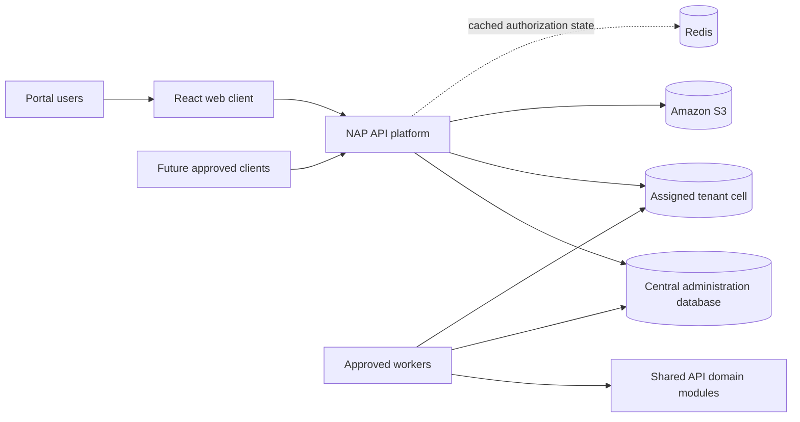
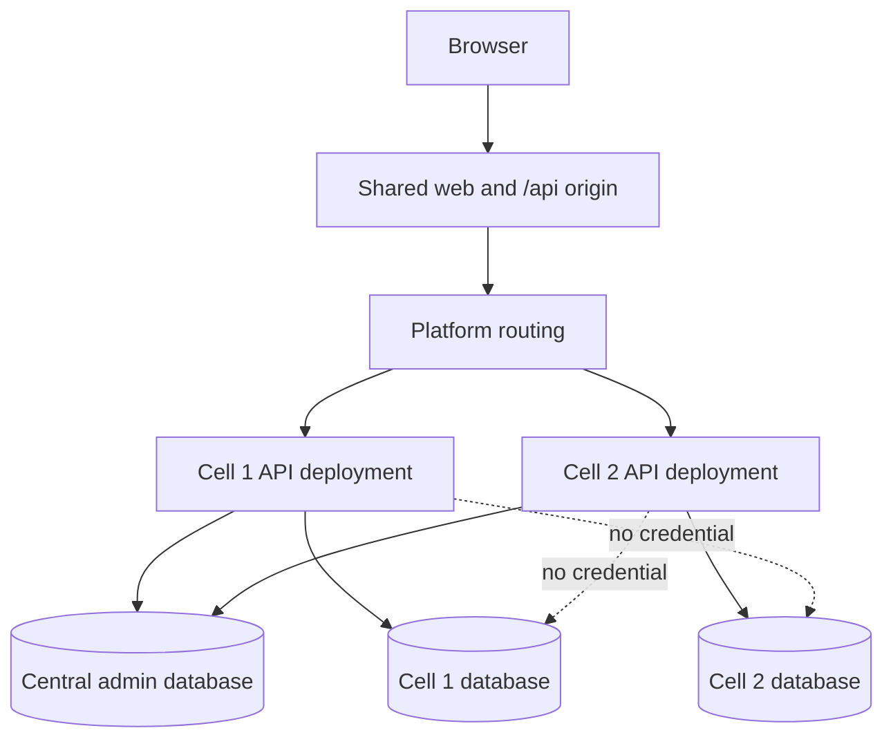
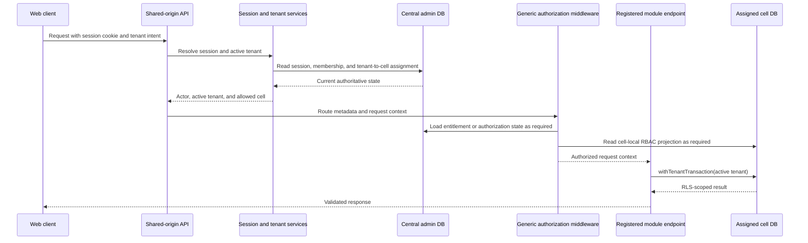

# NAP Platform Specification

**Version:** 1.1.0

**Date:** 2026-09-05

## Overview

This specification defines the NAP platform. It states the requirements every
component, deployment, and client must satisfy, and it owns the repository
structure those requirements produce: folders, import layers, module ownership,
and how one source tree maps to web, API, cell, worker, dedicated, and
self-hosted deployments.

NAP is a horizontal, project-native ERP. It is delivered as a modular-monolith
API with independently deployable clients, a central administration database,
and one or more tenant cells. The React web application is the first API
client.

This specification is cross-cutting and owns no business router or table.
Component PRDs own functional APIs and physical table definitions.

## How this specification is used

Every product requirements document (PRD), architecture decision record (ADR),
and RULES document derives from this specification. It governs them; none of
them relaxes, reinterprets, or works around it.

- A requirement identifier is permanent. `ARCH-*` numbers are the citation
  surface for every derived document, so they are never renumbered or reused. A
  requirement that no longer applies is marked withdrawn and keeps its number.
- A component PRD states what its component does and cites the requirement
  identifiers it implements. It does not restate a requirement in its own
  words, because a second wording is a second source of truth.
- An ADR records a choice this specification deliberately leaves open, or the
  rationale for amending it. It is not where platform technology or structure
  is decided; the technology stack and repository structure sections decide
  those.
- A RULES document names the requirement it implements. A convention with no
  requirement behind it is a preference and belongs in contributor guidance
  instead.
- An ADR or RULES document is not orphaned because its feature is unbuilt. Its
  parent is the requirement it cites, and it is consumed when that feature's
  PRD is written.
- The specification is amended first. When implementation shows the
  architecture is wrong, the amendment lands before the code or the PRD that
  depends on it; the specification is never corrected as a side effect of
  building something else.
- A conflict between this specification and what a PRD, an ADR, or an
  implementation requires stops the work. It is raised and resolved with the
  owner before either document changes.
- Each requirement's conformance entry names the evidence that proves it, and a
  change to a requirement ships with that evidence.

This specification owns neither build order nor implementation status. The
development roadmap owns sequencing; merged code, migrations, and passing tests
own what actually exists.

## Defined terms

| Term              | Meaning                                                                                                                                                                                               |
| ----------------- | ----------------------------------------------------------------------------------------------------------------------------------------------------------------------------------------------------- |
| Tenant            | The paying customer licensed to use NAP                                                                                                                                                               |
| Company           | An LLC, S corporation, corporation, or other organization controlled by one tenant                                                                                                                    |
| Project           | A group of work performed by one company                                                                                                                                                              |
| Project Component | A recursively nested part of a project; tenants configure display names such as Building, House, Apartment, Office, Store, or Sub-project                                                             |
| Cell              | A database and deployment boundary holding the business data of one or more assigned tenants                                                                                                          |
| Module            | One domain owner. It exclusively owns a set of tables, their migrations, their repositories, their domain rules, and the API routes that expose them, and targets exactly one database and one schema |
| Service           | Request-time code in `apps/api/src/services/` that owns no tables and reads some module's tables, because middleware may not import a module                                                          |
| Physical schema   | A data classification inside one database — `admin`, `cell`, `reference`, `app`, or `reporting`. It names no owner                                                                                    |
| Product area      | A roadmap and navigation grouping. It names no owner and confers no table ownership                                                                                                                   |

One tenant controls many companies. A company belongs to one tenant. A company
has many projects, and a project belongs to one company. Project Components
use a parent reference, permit unlimited domain nesting, and reject cycles.
Tenants configure component types and allowed parent-child relationships;
modules use the stable internal term `Project Component`.

The last four terms are enforced by `ARCH-047` and `ARCH-048`. They are distinct concepts and are not
interchangeable: a module is an owner, a service is a request-time reader, a
schema is a classification, and a product area is a grouping.

Do not use `entity` as a generic business synonym. It is acceptable only when
a technical model genuinely applies to several named record types and the
owning PRD defines that polymorphism.

## System context



## Deployment topology



The dotted paths are prohibited. A dedicated managed tenant may be the only
tenant in a cell. A self-hosted installation runs the same topology with its
own admin database and one or more local cells.

## Authenticated request flow



The route registry is a composition root. Middleware consumes generic
services, database access, utilities, route metadata, and request context; it
does not import a business module. The module endpoint is invoked only after
the generic authorization boundary succeeds. The session and tenant
participants above are services under `ARCH-048`, not modules.

## Technology stack

NAP is built on one fixed stack (`ARCH-051`). This section owns what may be
depended on; package manifests, the lockfile, `.nvmrc`, and
`tsconfig.base.json` own the exact installed versions and compiler settings.

| Concern                | Choice                                                        | Boundary                                                                                             |
| ---------------------- | ------------------------------------------------------------- | ---------------------------------------------------------------------------------------------------- |
| Runtime                | Node.js, version pinned by `.nvmrc`                           | Every workspace runs the same major version                                                          |
| Language               | TypeScript in strict mode, ES modules, `nodenext` resolution  | No JavaScript source files and no implicit `any` in production code                                  |
| Repository             | npm workspaces in one monorepo                                | `apps/api`, `apps/web`, and `packages/shared` build independently                                    |
| Database               | PostgreSQL 18 or later                                        | Row-level security, `set_config`, and partial unique indexes are assumed available                   |
| Persistence            | `pg-schemata` over `pg-promise`                               | The only data-access abstraction (`ARCH-049`); `pg-promise` is reached only through it               |
| API framework          | Express                                                       | Used through `framework/`; modules do not construct routers or touch request objects directly        |
| Transport contracts    | Zod schemas in `@nap/shared`                                  | The one validation library on both sides of the API boundary (`ARCH-043`)                            |
| Credentials            | Argon2id password hashing                                     | No second hashing scheme; parameters are owned by the identity component PRD                         |
| Sessions               | Session cookie signed with `jose`                             | The cookie carries a reference, never an authorization decision (`ARCH-022`, `ARCH-023`)             |
| Logging                | `pino`, JSON records on standard output                       | One logger; the platform owns log destination and retention                                          |
| Cache                  | Redis                                                         | Keeps session and authorization lookups off the database path; PostgreSQL still decides (`ARCH-029`) |
| Object storage         | Amazon S3                                                     | Holds every binary document; the SDK stays behind an API service (`ARCH-030`)                        |
| Web framework          | React with React Router                                       | One router; route-level lazy loading at module boundaries                                            |
| Web UI kit             | MUI, MUI X Data Grid, and Emotion                             | One component library and one styling mechanism; no second UI kit or CSS framework                   |
| Web build              | Vite                                                          | The web client is a static build served beside the API origin                                        |
| Tests                  | Vitest, with Supertest for HTTP and Testing Library for React | One test runner across every workspace                                                               |
| Lint and format        | ESLint with `typescript-eslint`, and Prettier                 | Formatting is checked, not negotiated per file                                                       |
| Continuous integration | GitHub Actions                                                | The pull-request gate runs the repository checks below                                               |

The repository check commands are `lint`, `format:check`, `typecheck`, `test`,
`build`, and `licenses`. Continuous integration runs the same commands as the
local loop against a PostgreSQL service with separate admin and cell databases
and the least-privileged runtime role, so a tenant-isolation failure is caught
by the gate rather than by review.

Three rules keep the stack fixed. One choice fills each role above: a second
HTTP framework, ORM, validation library, UI kit, or test runner is a deviation,
not a preference. A provider-specific dependency is reached through an API
service rather than imported by a module or a page. Every production dependency
carries a license listed in `.licenses-allowed.json`, and adding one is part of
the change that introduces it.

Adding to, removing from, or replacing an entry in that table is a change to
this section, made with the code that requires it.

## Repository structure

This section owns physical placement, import direction, and ownership. It does
not restate behavior, which the requirements below own, and it does not define
build order, which the development roadmap owns.

### Repository skeleton

```text
nap/
├── apps/
│   ├── api/
│   │   ├── src/
│   │   │   ├── db/
│   │   │   │   ├── admin/
│   │   │   │   └── cell/
│   │   │   ├── util/
│   │   │   ├── services/
│   │   │   ├── middleware/
│   │   │   ├── framework/
│   │   │   │   ├── ReadController.ts
│   │   │   │   ├── WriteController.ts
│   │   │   │   └── createRouter.ts
│   │   │   ├── modules/
│   │   │   │   └── <feature>/
│   │   │   └── scripts/
│   │   ├── tests/
│   │   │   ├── unit/
│   │   │   ├── integration/
│   │   │   ├── isolation/
│   │   │   └── fixtures/
│   └── web/
│       ├── src/
│       │   ├── api/
│       │   ├── auth/
│       │   ├── shell/
│       │   ├── pages/
│       │   ├── theme/
│       │   ├── components/
│       │   └── lib/
│       └── tests/
├── packages/
│   └── shared/
│       ├── src/
│       └── tests/
├── docs/
│   ├── specs/
│   ├── PRDs/
│   ├── ADRs/
│   ├── RULES/
│   ├── implementation-plans/
│   ├── roadmaps/
│   ├── reference/
│   └── branding/
├── scripts/
├── .github/
├── .husky/
└── .vscode/
```

Independently buildable `apps/web` and `apps/api` workspaces in one monorepo
implement `ARCH-001`–`ARCH-003`. Separate `db/admin` and `db/cell` composition
roots, with no code tree per physical cell, implement `ARCH-004`–`ARCH-010` and
`ARCH-024`.

The repository skeleton shows stable folder placement rather than the files
that happen to exist today. The module-shape section below is the exception: it
defines the repeatable files and folders for a feature module. The tree is not
an instruction to create empty folders; a business-module directory is created
with its first accepted component PRD and vertical slice.

`tests/fixtures/` holds the shared tenant-isolation harness every tenant-aware
module registers, and the `isolation_probe` table used to prove the boundary
before any business module exists. The probe is a fixture: it is registered by
the isolation suite and never by the cell module registry. One cell module set,
one tenant transaction helper, this isolation-test suite, and module-owned RLS
migrations implement `ARCH-013`–`ARCH-021`, `ARCH-033`, and `ARCH-037`.

### API import layers

| Layer         | May import               | Contents                                                                                                     |
| ------------- | ------------------------ | ------------------------------------------------------------------------------------------------------------ |
| `util/`       | nothing                  | Pure helpers, logging adapters, cookies, hashing, identifiers                                                |
| `db/`         | `util`                   | Database composition roots, migration registries, tenant transaction helper, Redis client                    |
| `services/`   | `db`, `util`             | Cross-module orchestration such as routing, provisioning, projection synchronization, and cache invalidation |
| `middleware/` | `services`, `db`, `util` | Authentication, tenant selection, entitlement, RBAC, resource scope, error handling                          |
| `framework/`  | lower layers             | `ReadController`, `WriteController`, and `createRouter` (`ARCH-050`)                                         |
| `modules/`    | lower layers             | Feature routers, controllers, models, repositories, migrations, and domain behavior                          |
| `scripts/`    | any layer as needed      | Maintenance and release operations outside the runtime import graph                                          |

Runtime code does not import from `scripts/`. A workflow spanning multiple
module owners belongs in `services/`, not in an arbitrary feature module.

The database module registries and API route registry are composition roots,
not ordinary members of the physical folder's import layer. They may import
module descriptors, repositories, migrations, and routers only to assemble the
application. This exception is required by `ARCH-042`.

Middleware does not import modules. Authentication, active-tenant selection,
entitlement, RBAC, and resource-scope middleware use shared services, database
access, utilities, route metadata, and request context. The registered module
endpoint runs only after those generic checks succeed. `ARCH-048` follows
directly from this: a capability middleware needs before authorization
completes is a service, never a module.

### Database composition roots

`db/admin/` constructs the central database handle and assembles admin-targeted
module repositories and migrations. `db/cell/` constructs the one cell handle
available to a cell deployment and assembles cell-targeted repositories and
migrations. `db/assertRuntimeRole.ts` is shared by both: readiness runs it
against each handle so a connection that could bypass or disable row-level
security fails startup rather than serving traffic.

`util/env.ts` resolves the environment and the connection string for each
database and role. Nothing else reads a connection variable, and a connection
string never leaves that module in an error message or a log line.

`withTenantTransaction.ts` is the application entry point for tenant business
work. The tenant transaction contract below defines its required
implementation.

The two migration runners are release commands, not server-start hooks.
Module-owned migrations enter exactly one registry according to the module
descriptor, satisfying `ARCH-025`–`ARCH-027`'s separate migration entry points
and per-module versioned routers.

Cell migration composition groups modules by schema and then iterates the
canonical `CELL_SCHEMAS` order. Module registration order never controls schema
execution order.

### Tenant transaction contract

`withTenantTransaction()` is the only general entry point for tenant-owned
queries, from HTTP request handling — including the framework controllers every
module router is built on (`ARCH-050`) — and from workers, imports, and
reports. Its contract is structurally equivalent to:

```ts
withTenantTransaction<T>(
  cellDb: CellDatabase,
  tenantId: string,
  work: (tx: CellTransaction) => Promise<T>,
): Promise<T>
```

The implementation must:

1. validate that `tenantId` is a UUID before sending it to PostgreSQL;
2. open a transaction through the supplied cell handle;
3. set `nap.tenant_id` for the life of that transaction, from a parameterized
   value, as the first statement;
4. run `work` with the transaction-bound repositories; and
5. commit or roll back before the connection returns to the pool.

PostgreSQL does not accept a bind parameter in `SET`, so step 3 is written as
`SELECT set_config('nap.tenant_id', $1, true)`. The third argument makes the
assignment transaction-local: this is `SET LOCAL` with a parameterized value,
not a session setting. Tenant selection never uses a session-level `SET`,
`search_path`, a repository `forSchema()` call, or a client-supplied database
address.

The callback returns only values that remain valid after the transaction ends.
It must not return the transaction object or a repository bound to that
transaction. An implementation can reject the transaction object by identity,
but a generic `T` cannot structurally exclude every transaction-bound
repository, so the broader prohibition is a caller obligation and a
code-review boundary rather than a type-system guarantee.

Cell repositories that read or write tenant-owned tables use the repository set
the transaction carries, not the equally named set on the cell handle. The
handle's connection holds no tenant context, so a read issued through it is
filtered to nothing rather than failing loudly. A domain service may accept an
existing tenant transaction to avoid nesting, but never falls back to the root
cell handle. A repository method does not accept a `tenant_id` as an
authorization substitute: an explicit tenant value used in an insert must agree
with the active transaction context and remains protected by the RLS
`WITH CHECK` expression.

Admin repositories are used outside a tenant transaction only for their central
control-plane responsibilities. A cross-database workflow completes one
database operation at a time with idempotency, revision, retry, and recovery
state; it does not simulate a distributed transaction.

Every tenant-owned migration adds `tenant_id`, a tenant-inclusive candidate
key, and tenant-inclusive foreign keys before the table is exposed to the
runtime role. The same migration enables RLS and creates both `USING` and
`WITH CHECK` policy expressions, which read the tenant context the same way:

```sql
tenant_id = NULLIF(current_setting('nap.tenant_id', true), '')::uuid
```

`NULLIF` is required, not stylistic. A pooled connection that has already
served a tenant reports the setting as an empty string rather than as unset, so
without `NULLIF` the policy raises a cast error on exactly the reused
connections and turns "no tenant context" into a failure instead of an empty
result.

RLS is not forced. PostgreSQL exempts a table's owner from its own policies,
and that exemption is deliberate: migrations and data corrections run as the
owning role and must see every tenant's rows. What makes the policy bind the
application is that the runtime role owns nothing, not `FORCE`. Grants are
applied to the non-owner runtime role after the policies exist.

### Module shape

Modules are flat. `admin-tenancy` uses the same internal shape as `projects`
and `accounting`.

```text
modules/<feature>/
├── apiRoutes/v1/
├── controllers/
├── models/
├── domain/
├── schema/migrations/
├── <feature>Repositories.ts
├── descriptor.ts
└── index.ts
```

The module's internal dependency direction is:

```text
apiRoutes -> controllers -> domain -> models/repositories
```

Controllers translate HTTP. Domain code owns business behavior. Repositories
own persistence. Models define query/table behavior. Migrations own physical
schema.

Those files follow one shared shape rather than being written per module: a
controller extends the `framework/` read or write controller and a router is
produced by `createRouter` (`ARCH-050`). The module authoring conventions below
own how those files are written.

A module targets exactly one database and exactly one schema (`ARCH-047`). This
is absolute, not a default: NAP has no concept of a module spanning schemas or
databases. Cross-database provisioning is a service coordinating separate
module operations.

### Module authoring conventions

This section owns how the files inside a module are written. A table has one
`TableSchema` definition and one model class extending `TableModel`, or
`QueryModel` for a read-only projection or view. The model is the module's
query surface; the migration that creates the table owns its frozen DDL and
never imports the model.

```ts
export const clientsSchema: TableSchema = {
  dbSchema: 'app',
  table: 'clients',
  hasAuditFields: { enabled: true, userFields: { type: 'uuid' } },
  softDelete: true,
  columns: [
    { name: 'id', type: 'uuid', default: 'gen_random_uuid()', immutable: true },
    { name: 'tenant_id', type: 'uuid', notNull: true, immutable: true },
    { name: 'name', type: 'varchar(128)', notNull: true },
    { name: 'code', type: 'varchar(16)', notNull: true },
  ],
  constraints: {
    primaryKey: ['id'],
    unique: [['tenant_id', 'id']],
    indexes: [{ columns: ['tenant_id', 'code'], unique: true }],
  },
};

export class Clients extends TableModel<ClientRow> {}
```

- `dbSchema` is a literal matching the schema its module descriptor declares.
  Runtime code never calls `forSchema()`; only the migration runners bind
  models to a schema, and only to the one they were given.
- A tenant-owned table declares `tenant_id` immutable, and its candidate keys,
  unique indexes, and foreign-key targets are tenant-inclusive as `ARCH-014`
  and `ARCH-015` require.
- Audit fields and soft deletion are declared in the schema rather than added
  by a handler or middleware.
- Column types, constraints, and index definitions live here and in the
  module's migration. The migration is authoritative for what the database
  contains; a change to either is made in the same pull request.

A controller declares which repository it works with and which permission scope
it belongs to. It contains no query text, no transaction handling, and no
tenant resolution, because the framework base classes own all three.

```ts
export class ClientsController extends WriteController<'clients'> {
  constructor(cellDb: CellDatabase) {
    super(cellDb, 'clients');
    this.rbacConfig = { module: 'core', router: 'clients' };
  }
}
```

The base classes guarantee, for every cell-targeted call:

```ts
return withTenantTransaction(this.cellDb, session.tenantId, async tx =>
  tx.clients.insert(dto)
);
```

- The tenant value comes from the resolved session. A tenant identifier in a
  body, query string, route parameter, or header is rejected rather than
  merged.
- Behavior beyond the standard operations belongs in the module's `domain/`
  directory and is called by the controller.
- Admin-targeted controllers use the admin handle's repositories directly;
  there is no tenant context to establish.

A router is one call to the framework factory carrying the module and router
metadata that entitlement and permission resolution need, plus any route the
module disables or adds.

```ts
export default (cellDb: CellDatabase) =>
  createRouter(new ClientsController(cellDb), {
    module: 'core',
    router: 'clients',
  });
```

- A module exports a router factory taking the database handle, not a
  module-level singleton. The composition roots own handle creation.
- Route paths are versioned per module under `apiRoutes/v<n>/`, as `ARCH-027`
  requires.
- The framework HTTP contract below owns the route set, middleware order,
  parameters, responses, and refusals that call produces.

`created_by` and `updated_by` are resolved by `pg-schemata`, not by a handler
or by middleware that rewrites the request body. The application registers one
actor resolver at startup that reads request-scoped storage, so the value
follows the authenticated actor through nested calls without being threaded
through every signature. A background job, migration, or import with no request
actor supplies an explicit service actor rather than leaving the resolver to
return nothing.

Every tenant-owned model registers with the shared isolation harness at
`apps/api/tests/fixtures/tenantIsolationHarness.ts`, which covers the attempts
`ARCH-033` requires plus operation with no tenant context and with an invalid
one. Router tests assert the generated route surface, including that disabled
operations return 404 and that permission and entitlement middleware run before
the handler.

### Framework HTTP contract

`framework/` owns the one HTTP surface every module presents (`ARCH-050`). A
module supplies a controller and one router-factory call. It does not write
route handlers, query text, pagination, transaction handling, validation, or
error mapping, so every module answers the same way and a change to that
behavior is made once.

`ReadController` serves a module's read routes and is the only controller a
read-only projection needs. `WriteController` extends it, so a writable
resource exposes the read routes as well.

| Route               | Kind  | Purpose                                        |
| ------------------- | ----- | ---------------------------------------------- |
| `GET /`             | read  | Filtered, sorted, paged list                   |
| `GET /:id`          | read  | One record by identifier                       |
| `POST /`            | write | Create one record                              |
| `POST /bulk-insert` | write | Create many records in one transaction         |
| `PUT /update`       | write | Update the records identified in the body      |
| `PUT /bulk-update`  | write | Apply many distinct updates in one transaction |
| `DELETE /archive`   | write | Soft-delete by setting `deactivated_at`        |
| `PATCH /restore`    | write | Reverse a soft deletion                        |
| `POST /import-xls`  | write | Load records from an uploaded spreadsheet      |
| `POST /export-xls`  | read  | Return the current result set as a spreadsheet |

Static paths register before parameterized ones and `GET /:id` registers last,
so no static route is shadowed. Every route is individually disableable, and a
disabled route answers exactly as an unregistered path does rather than
admitting that the operation exists. An uploaded spreadsheet is bounded input
that the request consumes; it does not become a stored document and does not
change the object-storage boundary in `ARCH-030`.

An operation outside that set is registered through the factory's extension
callback, which gives it the same middleware chain, transaction boundary,
validation, and error mapping as a standard route. A hand-assembled router is a
defect, not a variation.

Every request passes the same ordered chain: correlation identifier,
authentication, active-tenant resolution, module entitlement, permission,
resource scope, request-contract validation, the transaction and the operation,
response-contract validation, and error mapping. A cell-targeted request opens
exactly one `withTenantTransaction` around its operation, and any domain hook
the module registers runs inside that transaction so a refusal rolls back with
it. An admin-targeted controller has no tenant context and uses the admin
handle's repositories directly.

List routes accept a bounded page size, a sort expression, and a soft-deletion
selector that chooses active, archived, or both. Every other query parameter is
a filter validated against the model's `TableSchema`; an unknown column is
rejected rather than ignored, so a mistyped filter cannot silently widen a
result. A page size above the maximum is reduced to it, and the applied value
is reported back with the results. Sequential traversal of a large result set
uses keyset continuation rather than a growing offset.

Every response uses the versioned envelope `@nap/shared` defines. A success
carries `version` and its records under `data`; a list adds `page` with the
applied page size, the total matching the filter, and a continuation value when
one exists. A failure carries `version`, `code`, `message`, and `fieldErrors`
for input validation only. Write routes return the affected records under
`data` rather than a bare count, so a client does not re-read to learn what
changed.

Refusals are uniform. Input that fails contract validation returns field
errors. An unauthenticated request, a request whose tenant is not entitled to
the module, and a request whose actor lacks the permission are distinguishable
to the caller only as far as `ARCH-043` allows. A record outside the caller's
authorized scope answers as though it does not exist, so scope cannot be used
to probe for records. A batch write is all-or-nothing and names the identifiers
it refused. Payload and upload ceilings refuse before the body is read.

The framework owns none of the following: business behavior, which belongs in
the module's `domain/`; table shape, which belongs in the module's schema and
migrations; the permission vocabulary, which the access-control component PRD
assigns; and presentation, which belongs to the web client. A controller that
grows query or business logic signals that the behavior belongs in `domain/`,
or that every module needs an operation `framework/` does not yet have.

### Module descriptor

The descriptor is the structural declaration for a module. Its shape is
`pg-schemata`'s `ModuleDescriptor` plus two NAP-local fields, paired as a
discriminated union:

| Field            | Source                  | Meaning                                                                                                                                                                                    |
| ---------------- | ----------------------- | ------------------------------------------------------------------------------------------------------------------------------------------------------------------------------------------ |
| `name`           | `pg-schemata`           | Stable module identifier; becomes `module_name` in the migration tracking table                                                                                                            |
| `models`         | `pg-schemata`, optional | Repository constructors owned by the module. Earlier NAP documents called this field `repositories`. It derives module-level foreign-key ordering and builds `MigrationContext.models`     |
| `migrations`     | `pg-schemata`           | Ordered migrations. Array order is authoritative within a module; the manager never re-sorts it                                                                                            |
| `databaseTarget` | NAP                     | `admin` or `cell`: the one database this module's tables live in, and therefore the one registry it may appear in                                                                          |
| `schema`         | NAP                     | The one physical schema this module's tables live in: `admin` for an admin module, one of the canonical cell schemas for a cell module. The cell migration runner groups descriptors by it |

The union admits an admin module only with `schema: 'admin'` and a cell
module only with a cell schema, so a wrong combination fails typecheck, and
each migration runner asserts the pairing at runtime before it opens a
handle. That table is the descriptor's complete field set. API routers are
not among them: they are assembled by the route registry under `ARCH-042`'s
composition-root exception, in the shape `ARCH-050` requires.

### Persistence mechanism

`pg-schemata` is NAP's Object-Relational Mapper (ORM) and migration library. It
is owned by this organization (`github.com/silverstone-i/pg-schemata`), not a
third-party dependency, so a gap in it is fixed upstream rather than worked
around inside NAP. `ARCH-049` states the conforming shape and forbids a second
data-access abstraction over it.

### Web structure

Shared URL-state, active-tenant, theme, lazy-loading, drawer, responsive, and
navigation conventions are owned by the web shared behavior section below.

| Folder        | Owns                                                                                               | May depend on                                                                  |
| ------------- | -------------------------------------------------------------------------------------------------- | ------------------------------------------------------------------------------ |
| `lib/`        | Framework-agnostic helpers                                                                         | no MUI, React, router, transport, Authentication, page, or shell layer         |
| `api/`        | HTTP execution, shared-contract validation, and transport response adaptation                      | `@nap/shared`, `lib/`                                                          |
| `theme/`      | Tokens, MUI theme construction, shared styles, and mode selection                                  | `lib/`                                                                         |
| `components/` | Reusable presentation with no server business policy                                               | `theme/`, `lib/`                                                               |
| `auth/`       | Current-session state, authenticated-route gates, login/password form behavior, and auth actions   | `api/`, `components/`, `theme/`, `lib/`                                        |
| `shell/`      | Future tenant-aware application frame and normalized URL-derived product scope                     | `auth/`, `api/`, `components/`, `theme/`, `lib/`                               |
| `pages/`      | Routed page composition; pages delegate transport and session behavior to their owning lower layer | `auth/`, and when applicable `shell/`, `api/`, `components/`, `theme/`, `lib/` |

Dependencies point one way down that table. Lower layers do not import pages,
Authentication, or the shell. `App.tsx` is the mechanical route composition
root.

`theme/` additionally owns `styles.ts`, the shared style objects that keep
inline `sx` out of components; the shared-styles ladder below owns when to
reach for it.
`lib/` holds only code with no MUI or router dependency of its own, so a page
does not grow a private copy of a genuinely shared helper.

Module PRDs define their routed pages, workflows, actions, fields, and states.
The first tenant-aware product module must accept and establish the real product
shell, authorization-aware navigation, tenant URL vocabulary, and product-module
lazy boundaries. Authentication's login and account routes stay outside
`shell/` and may install session-aware production routing and shared transport
contracts, with real loading and error boundaries, without making any product
module reachable.

### Web shared behavior

This section owns behavior shared across web modules. Module PRDs own their
screens, fields, actions, workflows, and module-specific loading, empty,
denied, and failure states.

Shareable navigation state belongs in the URL: the active module, the selected
resource, filters that define a view, an open preview drawer, and the active
detail tab. Browser back and forward replay those states. Per-device theme and
default-tenant preferences may use local storage, but the server still verifies
the tenant on every request; a route value, local preference, cached response,
or token claim never grants tenant access.

The real product shell provides one shared reader for route and search-parameter
scope. Pages consume its normalized result instead of parsing route state
independently. If a selected project, company, or other resource does not belong
to the active tenant or parent scope, the reader treats it as unset, and every
consumer — pages, navigation, and badges — uses that same normalized scope so
displayed totals cannot disagree. The final tenant, company, and project route
vocabulary is accepted with the first real module shell integration.

Login and standalone account workflows remain outside the authenticated product
shell. An unauthenticated redirect carries its target in `?next=<encoded path>`
so a deep link survives login and reload.

Navigation lists only implemented modules that the active tenant is entitled to
use and the current actor may access. Hiding navigation is not an authorization
control: the API applies entitlement, RBAC, and resource scope before the
endpoint runs. At the MUI `lg` breakpoint and above, navigation is a permanent
collapsible rail holding at most two levels, module and submodule; a deeper
concept is reached inside a page rather than by adding another rail level.
Below `lg`, navigation is a temporary overlay that starts closed, closes after
selection or Escape, and restores focus to its trigger. Allowed, denied,
disabled, revoked-session, stale-state, and unavailable cases render intentional
states, and a client cache may make navigation faster but never widens access
after the server refuses a request.

Production code uses route-level lazy loading at module or major-page
boundaries. The shell, authentication state, active-tenant context, and small
shared UI primitives load eagerly. Every lazy boundary provides a real loading
state and chunk-load error handling; an artificial delay, a mock fallback, or
per-component chunking that turns ordinary page composition into a loading
waterfall is prohibited.

Module UI calls `apps/web/src/api/` through runtime-validated shared transport
contracts. Mock-backed business screens are not added while waiting for an API
design, and navigation does not expose a module until its real
authorization-aware route is available.

All colors and font stacks come from `theme/tokens.ts`, and components contain
no hex literals. Mode-varying colors are read through the active MUI theme;
components do not import a light or dark token set directly, and only
mode-invariant exports such as `gold` and the font stacks are imported
statically. `theme/ThemeModeProvider.tsx` owns `system | light | dark`,
defaults to `system`, follows `prefers-color-scheme`, and persists an explicit
choice in `nap:theme-mode`. Gold is not part of the MUI palette: the approved
product uses are the wordmark dot, the active rail indicator, and the invoice
final-total rule. Do not add gold to chips, badges, focus rings, icons, form
borders, sort indicators, selected rows, or product buttons.

Inline `sx` is a last resort, in this order:

1. a repeated MUI treatment belongs in `theme/theme.ts` component defaults;
2. shared layout belongs in `theme/styles.ts` as a named `SxProps<Theme>` value
   or a function of the value that varies; and
3. a genuine one-off may remain inline, and its second use moves it to a shared
   owner.

Mode-varying shared styles read their values through a theme callback.

At `lg` and above, a list may open a non-modal right-side preview drawer while
leaving the list usable; below `lg`, the same preview becomes a full-screen
sheet or routed page. Drawers are for reading, triage, approval, and explicitly
designed single-step actions. Multi-field editing and multi-step work use routed
pages with normal browser navigation. Drawer selection is represented by a URL
search parameter, so deep links and history reproduce the open, closed, and
selected states; closing a drawer removes only its parameter and preserves
unrelated URL state. A drawer is keyboard-operable and screen-reader-legible,
and no action inside one is reachable by hover alone.

### Shared package boundary

`packages/shared` contains runtime validation schemas for API transport
contracts and the TypeScript DTO types inferred from them, implementing
`ARCH-043`. Transport constants may live beside their schemas.

Each transport contract belongs to the component that defines its endpoint.
This section states the placement that rule produces inside the package, and
names the one case it does not cover.

- One folder per domain group under `packages/shared/src/`. A folder is named
  for the domain its contracts describe, not for a module and not for a
  service. The package contains no modules, so a domain folder does not
  conflict with the ownership map's statement that `identity` and
  `access-control` are not modules.
- A contract no domain owns lives in `transport/`. The `ARCH-043` error
  envelope is the first instance.
- Each folder carries its own `index.ts`. The package's root `index.ts` is one
  export line per folder, not one line per file.

```text
packages/shared/src/
├── index.ts            one export line per folder
├── transport/          contracts no domain owns
│   ├── index.ts
│   └── errors.ts       apiErrorSchema, ApiError
├── identity/           identity and session contracts
│   ├── index.ts
│   └── auth.ts
└── sales/              added when sales gets its first endpoint
    ├── index.ts
    └── opportunities.ts
```

```ts
export const apiErrorSchema = z.object({
  version: z.literal(1),
  code: z.string().min(1),
  message: z.string().min(1),
  fieldErrors: z.record(z.string(), z.array(z.string())).optional(),
});
```

`packages/shared/src/identity/` keeps its name.
to `admin-tenancy`.

### Documentation placement

The purpose and authority of each documentation folder are defined in the
[documentation index](../README.md). This section owns only their physical
placement.

`docs/implementation-plans/` holds conditional delivery records. Each filename
is `NNNN-<capability>.md`, where `NNNN` matches its owning PRD and
`<capability>` is its kebab-case capability name.

A plan is required only when delivery has at least one of these properties:

- it implements a feature defined by an accepted component PRD, even when the
  feature ships in one pull request;
- it requires more than one pull request;
- it changes an authentication, authorization, tenant-isolation, credential, or
  other security boundary;
- it includes a destructive or data-moving migration, backfill, compatibility
  window, or recovery procedure; or
- it requires staged deployment, feature gates, ordered release units, or a
  coordinated rollback.

A change without one of those properties proceeds directly from accepted design
to implementation. Creating a plan is never the delivered outcome: the task that
creates one continues into implementation.

A plan states its outcome, the accepted design it implements, its impact on
current code, its risks, the changes it requires, its pull-request sequence,
its tests and evidence, and its rollout and recovery path. It coordinates
delivery and is neither architectural nor status authority.

### How the skeleton supports growth

| Change                       | Structural effect                                                                                                       |
| ---------------------------- | ----------------------------------------------------------------------------------------------------------------------- |
| Add Cell 2                   | Deploy the existing API build with another cell configuration; create no source folder                                  |
| Add a tenant                 | Add records and seed data through provisioning; create no schema, migration tree, or code folder                        |
| Add a business module        | Add one flat API module, component PRDs, and registrations in the existing target registries                            |
| Add a worker                 | Add `apps/worker` only after approval; import API domain modules and database composition code rather than copying them |
| Add a dedicated managed cell | Reuse the API and migration artifacts with dedicated configuration                                                      |
| Add self-hosting             | Deploy the same web/API artifacts with local admin and cell databases                                                   |
| Add a client                 | Add a separate client workspace against the existing API boundary                                                       |

These growth paths implement `ARCH-038`: growth changes composition and
configuration without weakening identity, cell, or tenant boundaries. Managed,
dedicated, and self-hosted deployments reuse the same applications and module
registries, implementing `ARCH-034` and `ARCH-035`. Provider adapters remain
behind API services, and a worker workspace is added only when approved, under
`ARCH-030` and `ARCH-031`.

## Data tables

This specification owns database boundaries, physical schemas, and module
ownership, not component table columns. Table definitions become authoritative
in their component PRDs and module-owned migrations.

| Database boundary               | Physical schemas | Data ownership                                                                                                         |
| ------------------------------- | ---------------- | ---------------------------------------------------------------------------------------------------------------------- |
| Central administration database | `admin`          | Global identities, sessions, tenants, memberships, cell registry, tenant-to-cell assignment, and managed-service audit |
| Tenant cell database            | `cell`           | Cell-local tenant and membership projections used for enforcement                                                      |
| Tenant cell database            | `reference`      | Shared non-tenant reference data and application metadata                                                              |
| Tenant cell database            | `app`            | Shared tenant business tables protected by RLS                                                                         |
| Tenant cell database            | `reporting`      | Tenant-safe views over RLS-protected business tables                                                                   |

A physical schema is data classification and names no owner. Ownership is
assigned only by the module ownership map below.

[NAP Initial Table Schema](../reference/NAP-Initial-Table-Schema.md) is the
non-authoritative inventory used to plan component PRDs. No implementation may
treat that reference as a substitute for an accepted component PRD and
migration. Shared column, actor, timestamp, deletion, projection, and reference
rules are authoritative in the database record conventions below, and
component PRDs assign the database profiles those conventions define
(`ARCH-044`).

### Database record conventions

Every component-owned production table is assigned one of these profiles in its
component PRD, which documents only justified departures from it.

| Profile          | Location         | Use                                                            |
| ---------------- | ---------------- | -------------------------------------------------------------- |
| Central mutable  | `admin`          | Authoritative control-plane records that may change            |
| Tenant mutable   | `app`            | Tenant-owned business records protected by RLS                 |
| Append-only      | `admin` or `app` | Audit, approval, posted financial, and other immutable history |
| Cell projection  | `cell`           | Revisioned local copies used for cell routing or enforcement   |
| Shared reference | `reference`      | Non-tenant reference values shared by every tenant in a cell   |

Reporting views live in `reporting`. They are not a table profile and use
security-invoker behavior that preserves the caller's base-table RLS.

Central mutable tables do not carry `tenant_id` unless the table's business
purpose is to relate records to a tenant; a central `tenant_id` is a
control-plane attribute, not an RLS boundary. Tenant mutable tables have an
immutable, non-null `tenant_id`, expose `UNIQUE (tenant_id, id)`, and use
tenant-inclusive foreign and natural keys, every foreign key indexed with
explicit deletion behavior. Append-only tables deny `UPDATE` and `DELETE` to
`nap_app`, and corrections create reversal or superseding rows; such a table may
omit `updated_at`, `updated_by`, and `deactivated_at` when its component PRD
states that rows never change, but it still records creation time and actor.
Cell projections contain only the central data required for local enforcement or
routing, cannot be written by ordinary module endpoints, and are applied by
provisioning and synchronization workflows that use monotonic revisions, are
idempotent, and expose retry and recovery state. Shared reference tables have no
tenant owner and grant `nap_app` read access only.

A disposable test-only isolation fixture is not a sixth profile. It qualifies
for the exception only when it lives under tests rather than a business module,
is supplied explicitly to a test suite instead of entering a production
registry, and exists only to prove isolation behavior. Such a fixture may omit
the audit and deletion columns and its suite may hard-delete its rows. The
exception relaxes nothing else: a tenant-owned fixture keeps its immutable
`tenant_id`, tenant-inclusive keys and relationships, matching RLS policies,
transaction-local tenant context, and negative isolation tests.

Except for that fixture exception, and unless a component PRD states a
profile-specific exception, Central mutable, Tenant mutable, and Cell projection
tables use:

```text
id              uuid          primary key, default gen_random_uuid(), immutable
created_at      timestamptz   not null, database default transaction_timestamp()
updated_at      timestamptz   not null, database default transaction_timestamp()
created_by      uuid          actor id; nullable only for bootstrap or migration
updated_by      uuid          actor id; nullable only for bootstrap or migration
deactivated_at  timestamptz   nullable soft-deletion timestamp
```

The database owns timestamps: applications do not supply `created_at`,
`updated_at`, or `deactivated_at`. A trigger sets `updated_at` to
`transaction_timestamp()` on every update, and deactivation sets
`deactivated_at` and `updated_at` to the same transaction timestamp. There is no
`deactivated_by` column; the actor in `updated_by` is the actor who deactivated
the row.

`created_by` and `updated_by` hold a stable actor UUID representing a portal
identity or a trusted service, and the authoritative actor record holds the
service's name rather than a free-form name in an audit column. NULL is allowed
only while bootstrapping or in a migration that runs before an actor exists, and
a component PRD must not introduce another meaning for NULL. Actor UUIDs copied
into a cell do not create cross-database foreign keys.

Mutable records use soft deletion by default: queries representing active
records exclude `deactivated_at IS NOT NULL`, and active natural-key uniqueness
uses a partial unique index where appropriate. Hard deletion requires an
explicit retention, privacy, or administrative purge contract in the owning
component PRD, and referential actions must not silently hard-delete audit or
financial history.

- Money uses `numeric(14,2)` unless the owning PRD needs a larger range.
- Quantities and unit prices use `numeric(12,4)` unless the owning PRD
  justifies different precision.
- Currency codes use ISO `char(3)`.
- Calendar dates use `date`; events and deadlines use `timestamptz`.
- Short closed vocabularies use `text` with migration-owned `CHECK`
  constraints unless a reference table is required.
- All foreign keys are indexed and declare `ON DELETE` behavior.
- Cross-database identifiers remain UUID values without foreign keys.

Each migration owns a frozen schema snapshot or explicit DDL representing the
definition accepted when that migration was released. A released migration never
imports a current mutable model or calls a table blueprint that can change
later; schema changes receive new migrations. Fresh-database and upgrade-path
tests must produce the same final schema, and shipped migration files are
immutable except for a correction approved through the release process for an
artifact that has never reached an environment.

### Module ownership map

Sixteen modules, each targeting exactly one database and one schema
(`ARCH-047`). Component PRDs refine their owned group without moving another
module's ownership silently.

| Module                | Database/schema  | Owned capability group                                                                                                                                                                                                       |
| --------------------- | ---------------- | ---------------------------------------------------------------------------------------------------------------------------------------------------------------------------------------------------------------------------- |
| `admin-tenancy`       | `admin/admin`    | Tenants, tenant status, cell registry, tenant-to-cell assignment, module entitlements, managed-operation and impersonation audit, portal identities, credentials, sessions, login throttling, and user-to-tenant memberships |
| `cell-tenancy`        | `cell/cell`      | Tenant, membership, and entitlement enforcement projections                                                                                                                                                                  |
| `reference-data`      | `cell/reference` | Country and policy catalogs                                                                                                                                                                                                  |
| `core`                | `cell/app`       | Companies, employees, vendors, clients, contacts, addresses, contact methods, payment terms, tax identifiers, roles, permissions, state and field scopes, approvals, numbering, and preferences                              |
| `catalog`             | `cell/app`       | Material/product definitions, vendor SKUs and pricing, external matching and matching audit, material-only BOM assemblies, component quantities, and nested assembly relationships                                           |
| `projects`            | `cell/app`       | Company projects, recursive Project Components, memberships, project management, and operational changes                                                                                                                     |
| `cost-codes`          | `cell/app`       | Cost categories, activity definitions, and their valid combinations used to classify estimated, scheduled, committed, and actual project work                                                                                |
| `estimating`          | `cell/app`       | Estimate templates and versions, turnkey and BOM-derived cost inputs, material/labor breakdowns, bids, estimate approval, and release to production                                                                          |
| `scheduling`          | `cell/app`       | Project and Project Component schedules, activity occurrences, dependencies, operational milestones, gates, deliverables, and completion state                                                                               |
| `project-costs`       | `cell/app`       | Approved project cost baselines, approved cost changes, commitment and actual-cost references and rollups, forecasts, and variances                                                                                          |
| `sales`               | `cell/app`       | Opportunities, quotes, buyer selections, and pre-execution approval workflows                                                                                                                                                |
| `contracts`           | `cell/app`       | Binding agreements, immutable versions and snapshots, amendments, contractual change orders, milestones, and execution history                                                                                               |
| `accounting`          | `cell/app`       | Ledgers, accounts, journals, balances, periods, posting, and intercompany activity                                                                                                                                           |
| `accounts-payable`    | `cell/app`       | Purchase orders, vendor invoices, payment approvals, payments, allocations, and credit memos                                                                                                                                 |
| `accounts-receivable` | `cell/app`       | AR invoices, receipts, allocations, and credit memos                                                                                                                                                                         |
| `reporting`           | `cell/reporting` | Tenant-safe reporting views                                                                                                                                                                                                  |

Tenant/company/project ownership implements `ARCH-039` and `ARCH-040`.
The project workflow owners implement `ARCH-041`; separate `sales` and
`contracts` owners implement `ARCH-046`.

`admin-tenancy` owns both the operator-facing tenant-management routes and the
end-user login, logout, and password-reset routes. This is deliberate.
Authorization is enforced per route by middleware, not per module, so
co-locating the two audiences is not a security boundary and does not weaken
one. Do not split the module back apart on the assumption that it does.

`identity` and `access-control` are not modules. Session and identity
resolution is a service reading `admin-tenancy` tables; authorization is a
service reading `core`'s role and permission tables. Both are consequences of
`ARCH-042` and `ARCH-048`: middleware needs them before authorization
completes, and middleware may not import a module.

### Cell tenancy projection

`cell-tenancy` exposes no API routes and is written only by the
provisioning/synchronization service in `services/`. It receives no PRD of its
own. Its tables are documented as a section of the `admin-tenancy` PRD,
expressed as the projection of named `admin` columns, so the projection cannot
drift from its source silently. Admin identifiers copied into a cell remain
identifiers rather than cross-database foreign keys (`ARCH-016`).

### Product-area map

A product area groups navigation and roadmap sequencing. It is not a second
decomposition of the system: it assigns no table ownership, names no owner, and
a module may appear in several areas without that meaning anything is shared.
The module ownership map above is the only ownership record.

| Product area  | Modules and services contributing                                                        | Product responsibility                                                                                             |
| ------------- | ---------------------------------------------------------------------------------------- | ------------------------------------------------------------------------------------------------------------------ |
| Admin         | `admin-tenancy`, `cell-tenancy`                                                          | Tenant, user, membership, cell, provisioning, and managed-operation workflows                                      |
| Auth          | `admin-tenancy`; identity/session and authorization services                             | Authentication, sessions, entitlement, RBAC, and access policy                                                     |
| Core          | `reference-data`, `core`, `catalog`, future settings capability                          | Employees, clients, vendors, contacts, addresses, contact methods, countries, currencies, settings, and catalogs   |
| Accounting    | `accounting`                                                                             | General ledger, journals, periods, posting, balances, and close                                                    |
| A/P           | `accounts-payable`                                                                       | Purchase orders, vendor invoices, payment approvals, payments, allocations, and credits                            |
| A/R           | `accounts-receivable`                                                                    | Billing, invoices, receipts, allocations, and credits                                                              |
| Projects      | `projects`, `scheduling`, `project-costs`, `cost-codes`, `accounts-payable`, `contracts` | Project structure, schedules, operational and contractual changes, purchase orders, and project cost tracking      |
| Budgets       | `project-costs`, `estimating`, `cost-codes`                                              | Approved baselines, cost changes, commitments, actuals, forecasts, and variances                                   |
| Estimating    | `estimating`, `catalog`, `cost-codes`, `projects`                                        | Estimate templates, cost composition, bids, approval, and release to production                                    |
| Sales         | `sales`                                                                                  | Opportunities, quotes, buyer selections, and pre-execution approvals                                               |
| Contracts     | `contracts`                                                                              | Executed agreements, immutable snapshots, amendments, contractual change orders, milestones, and execution history |
| Reporting     | `reporting`                                                                              | Tenant-safe reports, drill-through, export, and reconciliation                                                     |
| Notifications | Future `notifications` module after its first accepted source                            | Delivery of accepted business and operational events                                                               |

## API

This specification defines platform constraints rather than component
endpoint paths.
Component PRDs own method/path tables and permission names. Every API route is
subject to the applicable `ARCH-*` requirements below.

API versions are owned per module. A module adding a new version does not force
other modules to change versions. Permissions are written
`module::router::action`, so the permission string names the owning module from
the ownership map above.

## Operational standards

This section owns application logging, request correlation, error handling,
audit separation, retries, health responses, and metrics. Component PRDs add
module-specific operational requirements without weakening these rules.

Every request receives a correlation identifier at the first trusted boundary. A
caller-supplied identifier is reused only after its format and length are
validated; otherwise one is generated. HTTP uses a validated UUID in
`X-Request-ID`, returns it in the response header, and carries it through logs
and approved background work the request starts. A correlation identifier
identifies an execution path: it is not an actor, tenant, authorization
decision, or idempotency key. It lives in request-scoped storage opened by the
boundary that assigned it, so lower layers, database adapters, and the audit
actor resolver read it without it being threaded through every signature. In the
API that store is `util/requestContext.ts`; startup, shutdown, and scripts run
outside a request and carry no correlation identifier.

Production logs are structured records carrying a timestamp, severity, stable
event name, and the correlation identifier when one exists. Module, route or
operation, actor, tenant, and record identifiers are added only when they help
operate the event and the caller is authorized for that context. A failure is
logged once, at the boundary that handles it; lower layers return or throw typed
failures rather than writing duplicate records, and expected client errors do
not need error-level logs unless they indicate abuse or an operational trend.

Passwords, password hashes, session or access tokens, cookies, secrets,
connection strings, raw authorization headers, raw throttle keys, and sensitive
request and response payloads are never logged. Redaction happens before the
logging call; a formatter is not the security boundary. The `pg-schemata`
adapter forwards the library's message under the request's identifier and
discards its structured payload, which can carry row values.

API errors use the shared versioned envelope `ARCH-043` requires, and
`@nap/shared` owns the registry of stable error codes that envelope carries. Expected
failures map to a stable code, a safe message, an appropriate status, and field
errors only for input validation. Unexpected failures return a generic safe
error and keep stack traces, dependency messages, SQL, hostnames, and other
diagnostic detail on the server. The transport boundary owns the final mapping
from typed application failures to HTTP, and web clients validate the envelope,
present the safe message or a defined fallback, and retain the correlation
identifier for support without displaying infrastructure detail.

Diagnostic logs explain system operation; database audit records preserve
security and business history. Logs never replace required records for
impersonation, authorization changes, approvals, postings, reversals, or other
immutable events, and audit records follow the actor, tenant, timestamp,
deletion, and append-only rules the database record conventions own.

Only failures classified as transient are retried. Attempts and elapsed time are
bounded and use backoff with jitter. A mutation is not retried unless its
accepted contract makes the operation idempotent or supplies an idempotency key.
Retries preserve the original correlation identifier, record each attempt
number, and surface terminal failure and recovery state instead of retrying
forever.

Health responses report only the status their intended probe needs and never
expose configuration, credentials, database addresses, or stack traces.
Liveness proves the process can respond; readiness proves only the dependencies
and security checks required before that deployment accepts work, and each new
deployment unit defines those checks in its PRD. Metrics use stable,
low-cardinality names and labels and are never labeled with tenant, user,
request, record, email, URL, or other unbounded identifiers.

## Requirements

### ARCH-001 — API platform boundary

The NAP API is the application platform. Web, mobile, workers, and approved
integrations are clients of the same server-owned business rules and data
boundaries.

### ARCH-002 — Modular monolith

The API remains a modular monolith with statically registered modules. Adding
cells does not create microservices. A service split requires measured need and
an accepted superseding decision.

### ARCH-003 — Independent release units

The web client and API remain in one monorepo but are independently buildable
and deployable. Database migrations are separate release operations.

### ARCH-004 — Separate databases from the first cell

Managed NAP begins with a central administration database and a separate Cell
1 database. They may share a PostgreSQL instance initially but retain
independent connection pools, migrations, backup, restore, movement, and
lifecycle.

### ARCH-005 — Central control-plane authority

The central administration database is authoritative for global identities,
sessions, tenant records and status, user-to-tenant membership, cell records,
tenant-to-cell assignment, and managed-service impersonation audit.

### ARCH-006 — No tenant business data in the control plane

Projects, invoices, vendors, accounting transactions, and other tenant
business records must not be stored in the central administration database.

### ARCH-007 — Stable client addresses

Cell identifiers, database hosts, and routing details are infrastructure
concerns. They must not appear in permanent customer URLs or client API
contracts.

### ARCH-008 — Secret ownership

Database credentials belong to deployment secret configuration. They must not
be stored in tenant or cell rows, returned to clients, or written to logs.

### ARCH-009 — Cell connectivity boundary

A cell API deployment may connect to the central administration database and
its own cell database. It must not receive credentials for or connect to an
unrelated cell database.

### ARCH-010 — Repeatable and recoverable cells

A cell is a repeatable deployment unit containing the API modular monolith, one
cell database, shared RLS-protected tables, enforcement projections, and
tenant-safe reporting. A cell is independently deployable and recoverable;
failure or maintenance in one cell must not make unrelated cells unavailable.

### ARCH-011 — Evidence-based cell placement

Cells are added or selected using measured capacity, isolation, regional, data
residency, recovery, or contractual requirements. New tenants may be placed in
a new cell without moving existing tenants.

### ARCH-012 — Controlled tenant movement

Moving a tenant requires a complete tenant-scoped copy, verification of data
and isolation, an authoritative central assignment change, and a controlled
recovery window. The client address does not change.

### ARCH-013 — Shared physical tables

A cell has one physical set of application tables. NAP must not create schemas
or tables per tenant. Module entitlement is enforced by the application and
does not create tenant-specific physical tables.

### ARCH-014 — Immutable tenant key

Every tenant-owned row has an immutable, non-null `tenant_id`, except the
cell-local tenant projection whose `id` is the tenant key.

### ARCH-015 — Tenant-inclusive relational integrity

Tenant tables expose a tenant-inclusive candidate key, and relationships
between tenant-owned rows use composite foreign keys containing `tenant_id`.
Tenant-specific natural-key constraints also include `tenant_id`.

### ARCH-016 — No cross-database foreign keys

Admin identifiers copied into a cell remain identifiers rather than
cross-database foreign keys. Controlled, revisioned workflows synchronize the
cell-local projections required for enforcement.

### ARCH-017 — Row-level security

Every tenant-owned table enables PostgreSQL RLS with both read and write policy
expressions. The application connects as a non-owning role (`ARCH-019`), so the
policies apply to it. RLS and tenant-inclusive relational constraints are both
required.

### ARCH-018 — Transaction-local tenant context

Every tenant operation runs inside a cell transaction that sets
`nap.tenant_id` with `SET LOCAL` before tenant queries. Tenant isolation must
not use `search_path`, a schema switch, or pooled session state.

### ARCH-019 — Least-privileged database roles

The application runtime role does not own tables and does not have
`SUPERUSER`, `BYPASSRLS`, or permission to disable tenant policies. Migration
and controlled administrative roles remain separate.

### ARCH-020 — Uniform non-HTTP isolation

Workers, reports, imports, batch operations, and tests use the same
tenant-scoped transaction mechanism as HTTP requests.

### ARCH-021 — Controlled cross-tenant administration

A product feature that spans tenants is an explicitly authorized application
entry point running on the ordinary runtime role, with an explicit scope and an
audit record the application writes. Cross-tenant access is not obtained by
bypassing the database boundary, and the migration credential is a release
mechanism rather than a product feature.

### ARCH-022 — Server-owned access resolution

The server resolves identity, session validity, tenant membership, cell
assignment, entitlements, roles, permissions, and resource access. A
client-supplied tenant ID or cell value expresses intent only and cannot select
a database or grant access. Every authenticated request has exactly one active
tenant before tenant-owned work begins.

### ARCH-023 — Authoritative routing and authorization data

PostgreSQL is authoritative for tenant-to-cell assignment and authorization
state. Redis, JWT claims, and client caches must not independently grant access
or override current database state.

### ARCH-024 — Explicit database handles

An API deployment creates explicit, independently typed and independently
closable admin and cell database handles. Repositories, migrations, bootstrap,
audit context, and lifecycle remain bound to the owning handle.

### ARCH-025 — Explicit migration targets

Admin migrations run once per admin database and cell migrations run once per
cell database. Migrations never run once per tenant and never run implicitly on
every application startup.

### ARCH-026 — Compatible database evolution

Production schema changes use expand-and-contract sequencing so compatible API
and client versions can overlap during deployment.

### ARCH-027 — Compatible API evolution

The API contract is a product boundary. Changes remain compatible across the
supported deployment window so the API can be deployed before clients that use
new behavior.

### ARCH-028 — Controlled tenant provisioning

A tenant remains pending until central records, the cell-local tenant
projection, initial configuration, membership projections, and negative RLS
verification succeed. Partial failure remains recoverable and must not activate
the tenant.

### ARCH-029 — Redis accelerates, PostgreSQL decides

Redis caches derived session, routing, and authorization state so those lookups
do not reach the database on every request. It is part of a managed deployment,
not a possibility a deployment may ignore.

Correctness never depends on it. Cache misses, eviction, restart, and outage
retain a correct PostgreSQL-backed path, Redis is never the sole copy of
security state, and a write that changes authorization invalidates the entries
it affects.

The PostgreSQL-backed path is built and proven first. Redis is added in front of
a working path, so it can be switched off without changing any authorization
outcome.

### ARCH-030 — Object storage boundary

Amazon S3 holds NAP's binary documents: executed contract documents and
amendment attachments, vendor invoice images, issued customer invoices, project
drawings, specifications, and photographs, catalog and product images, retained
import files, and attachments on employee, vendor, client, and company records.
An owning component PRD names the documents it stores; none of them are stored
in the database.

PostgreSQL stores their metadata, tenant ownership, integrity information, and
access-control references, so a document is found, authorized, and audited
through the same tenant boundary as any other record. Keeping the bytes out of
the database keeps backup, restore, and cell movement proportional to business
data rather than to accumulated file volume (`ARCH-036`).

The S3 SDK is reached through an API service. No module, page, or migration
imports it, and a client never receives a durable storage address.

### ARCH-031 — Workers are justified deployment units

A worker deployment is added only when background workload or operational
isolation justifies it. Workers reuse API domain modules and the tenant
transaction boundary rather than implementing a second business layer.

### ARCH-032 — Immutable audit and financial history

Security audit, impersonation, approval, and posted financial records are
append-only where designated by their component PRDs. Corrections use reversal
or superseding records.

### ARCH-033 — Negative isolation verification

Every tenant-aware component includes negative tests that deliberately attempt
cross-tenant reads, inserts, updates, deletes, and foreign-key references.

### ARCH-034 — Dedicated managed cells

A managed tenant may receive dedicated cell infrastructure while continuing to
use the central managed administration service. Dedicated placement changes
configuration and operations, not the domain model.

### ARCH-035 — Fully isolated self-hosting

A self-hosted installation uses the same architecture with its own local admin
database and one or more local cells and has no runtime dependency on
NapSoft's central service.

### ARCH-036 — Database recovery independence

PostgreSQL is managed separately from application deployments. Database
recovery must not depend on packaging, redeploying, or rolling back an API
container.

### ARCH-037 — Tenant-safe reporting

Reporting preserves the caller's tenant boundary. Views and future reporting
infrastructure must not execute with privileges that bypass base-table RLS or
combine tenants without controlled administrative authorization.

### ARCH-038 — Additive growth test

Adding a client, tenant, module, worker, dedicated deployment, or cell must not
weaken the central identity boundary, cell connectivity boundary, or tenant RLS
boundary.

### ARCH-039 — Tenant and cell cardinality

Each tenant has exactly one active cell assignment at a time. A cell may hold
many tenants, and all companies, projects, Project Components, and other
tenant-owned module data follow the tenant to that cell.

### ARCH-040 — Portal membership and active tenant

Every portal identity uses one membership model capable of associating it with
multiple tenants. Application guards limit ordinary employee and client users
to one active tenant membership; vendor users may hold active memberships in
multiple tenants. Every ordinary tenant-data request has exactly one active
tenant, and a user must explicitly switch before accessing another.

Centrally authorized `package_admin` and `support` users may be granted access
to or impersonation of any tenant through RBAC and controlled-administration
rules without creating ordinary memberships in every tenant. Each privileged
tenant-data request still has exactly one target tenant and uses the controlled
authorization and audit path. A cross-tenant operation remains a separate,
explicitly scoped administrative entry point under `ARCH-021`. The RBAC and
controlled-administration PRDs assign the exact permissions to each platform
role.

### ARCH-041 — Project cost module boundaries

Projects owns company projects, the recursive Project Component hierarchy,
project management, and operational changes. Cost Codes owns the shared cost
categories, activity definitions, and valid combinations used across the project
workflow. Catalog owns material/product definitions, vendor pricing and matching,
and material-only BOM assemblies and quantities; BOM is not a separate module.

Estimating owns pre-production estimates, templates, bids, approval, and release.
Release preserves the approved estimate and establishes a Project Costs-owned
baseline without transferring the estimate's ownership. Project Costs owns
approved cost changes, commitment and actual-cost references and rollups,
forecasts, and variances through Project Components to the project. A/P owns
purchase orders and payable transactions; Project Costs references those source
records rather than owning them.

Scheduling owns project and Project Component schedules, occurrences of the
activity definitions owned by Cost Codes, dependencies, operational milestones,
gates, deliverables, and completion state. Contractual milestones and amendments
remain with Contracts under `ARCH-046`. Component PRDs define exact release,
approval, reconciliation, and event contracts. Manufacturing workflow, if
introduced, may reference these owners without transferring their ownership.

### ARCH-042 — Composition-root exception

Database module registries and API route registries are static composition
roots. They may import module descriptors and routers for assembly.
Middleware does not import modules; it authorizes registered
routes through shared services, database access, route metadata, and request
context.

### ARCH-043 — Shared transport boundary

`@nap/shared` contains runtime validation schemas and inferred TypeScript DTOs
for API transport contracts. Every API error response uses the versioned
envelope defined there — `version`, a stable machine-readable `code`, a safe
`message`, and `fieldErrors` only for input validation — and the package owns
the registry of codes that envelope carries. The API validates requests and
responses at its transport boundary; clients validate responses before adapting
them for UI. The package contains no database rows, repositories, migrations,
domain behavior, authorization decisions, client components, server
configuration, or generic utility collections.

### ARCH-044 — Database record conventions

Every component-owned production table is assigned a central mutable, tenant
mutable, append-only, cell projection, or shared reference profile. Disposable
test-only isolation fixtures that never enter production registries use the
narrow exception defined by the authoritative database conventions. That
exception does not relax migration stability, role separation, RLS, or tenant
isolation. Actor IDs, database-managed timestamps, soft deletion,
immutable-history enforcement, projection writes, and reference-data access
otherwise follow those conventions.

### ARCH-045 — Safe and correlated operations

Application requests, approved background work, and failures follow the
operational standards section above. Operations carry a correlation
identifier, produce structured redacted diagnostics, keep
safe client errors separate from server detail, and preserve required database
audit records independently of logs. Retries are bounded and safe, health
responses expose no infrastructure detail, and metrics avoid unbounded or
sensitive labels. No logging or monitoring vendor is part of this requirement.

### ARCH-046 — Binding agreement boundaries

Sales owns opportunities, quotes, buyer selections, and their approval
workflows before execution. Contracts owns executed binding agreements of any
kind, agreement versions, immutable scope and pricing snapshots, amendments,
contractual change orders, milestones, and execution history. Contracts may
originate a generic agreement or accept an approved obligation from Sales,
Projects, A/P, or another source module.

Catalog, Estimating, Projects, and other source modules retain their
working records. Approval creates an immutable contract snapshot or amendment;
it does not transfer the source record. Projects owns project management,
Project Components, and operational changes that do not amend an agreement;
Scheduling owns operational schedules and milestones under `ARCH-041`.

Contracts records milestone state and emits an auditable domain event. The
consumer decides whether and how to create a downstream record. A/R and A/P
own their financial source records, including A/P purchase orders, invoices,
receipts, payments, allocations, and accounting effects;
Contracts does not create those records directly. Component PRDs define exact
agreement lifecycles, milestone types, event contracts, APIs, permissions, UI,
and accounting treatment.

### ARCH-047 — One module, one owner, one database, one schema

A module is one domain owner. It exclusively owns a set of tables, the
migrations that create them, the repositories that read and write them, the
domain rules that govern them, and the API routes that expose them. Every
production table has exactly one owning module, named in the module ownership
map.

A module targets exactly one database and exactly one schema. This is absolute,
not a default: no module spans schemas or databases, and no descriptor,
registry, or migration path may express one. Work that touches two databases is
a service coordinating separate module operations.

### ARCH-048 — Services own no tables

A service lives in `apps/api/src/services/` and owns no tables. Any capability
whose data must be read at request time before authorization completes is a
service reading some module's tables, because middleware may not import a
module (`ARCH-042`). Identity and session resolution, authorization,
entitlement, provisioning, and projection synchronization are services, not
modules.

### ARCH-049 — pg-schemata is the persistence mechanism

Modules persist through `pg-schemata`, the organization-owned ORM and migration
library. A module defines its tables as `TableSchema`
definitions and its repositories as classes extending `TableModel`, or
`QueryModel` for read-only projections and views. Schema changes are authored
with `defineMigration` and registered through the module descriptor. Audit
actor resolution, foreign-key ordering, and constraint definition use
`pg-schemata`'s own facilities. No second data-access abstraction is introduced
over it, and hand-written raw SQL in a migration or a repository holding a
connection without extending a `pg-schemata` model is a deviation to be closed,
not a pattern to copy.

### ARCH-050 — Uniform module HTTP surface

A module exposes its routes through the `framework/` router factory applied to a
controller extending the shared read or write controller. Endpoints beyond the
standard set are added through the factory's extension callback rather than a
hand-assembled router, so every module presents the same route surface,
middleware order, and error mapping.

A cell-targeted controller performs every database call inside
`withTenantTransaction` and uses the repositories bound to that transaction, not
the ones on the cell handle. The active tenant comes from the resolved session;
request input never selects it.

The standard route set, middleware order, list parameters, response envelope,
and refusal behavior are defined by the framework HTTP contract above.

### ARCH-051 — Fixed technology stack

One runtime, language, database, persistence library, HTTP framework,
validation library, UI kit, build tool, and test runner serve the whole
platform, as the technology stack section defines. A second dependency filling
a role already filled is a deviation. Provider-specific dependencies are
reached through an API service rather than imported by a module or a page, and
every production dependency carries an allowed license.

## Out of scope

- Component-specific workflows, tables, routes, permissions, and status
  transitions belong in component PRDs.
- Exact indexes, checks, and migration SQL belong in module-owned migrations.
- Capacity thresholds and automated placement algorithms require operational
  evidence and a later accepted decision.
- Automated tenant movement requires a dedicated PRD after multiple cells
  exist.
- Materialized reporting requires a tenant-safe refresh and access design.
- Microservice decomposition is not part of the initial platform.
- OpenAPI generation is intentionally excluded.
- Module-specific cost-code, catalog/BOM, estimating, scheduling, project-cost,
  project, and manufacturing workflows belong in their component PRDs.
- Sales and Contracts workflows, agreement types, signatures, lifecycle states,
  milestone types, and event payloads belong in their component PRDs.
- Tenant-configurable Project Component labels and relationship catalogs belong
  in the Projects component PRDs.
- The request-time module entitlement gate, including whether the descriptor
  gains a `licensable` field, belongs to the RBAC and module-entitlement
  capability in the development roadmap.

## Conformance

| Requirement                                                | Observable proof                                                                                                                                                                                                                               |
| ---------------------------------------------------------- | ---------------------------------------------------------------------------------------------------------------------------------------------------------------------------------------------------------------------------------------------- |
| `ARCH-001`–`ARCH-003`, `ARCH-027`                          | Web and API build and deploy independently; supported client and API versions interoperate                                                                                                                                                     |
| `ARCH-004`–`ARCH-010`, `ARCH-024`, `ARCH-036`              | Admin and cell handles target distinct databases; each can migrate, close, back up, restore, and move without operating on the other                                                                                                           |
| `ARCH-011`, `ARCH-012`, `ARCH-028`, `ARCH-034`, `ARCH-035` | Provisioning, placement, movement, dedicated-cell, and self-hosted acceptance tests preserve stable client addressing and recoverable state                                                                                                    |
| `ARCH-013`–`ARCH-021`, `ARCH-033`, `ARCH-037`              | Automated negative tests fail every attempted cross-tenant read, write, delete, relationship, and reporting path even when application predicates are omitted                                                                                  |
| `ARCH-022`, `ARCH-023`, `ARCH-029`                         | Membership revocation, stale tokens, cache eviction, and Redis outage cannot increase access and retain a database-backed decision path                                                                                                        |
| `ARCH-025`, `ARCH-026`                                     | Release tests prove migrations run against explicit targets and permit the supported old/new application overlap                                                                                                                               |
| `ARCH-030`–`ARCH-032`                                      | Binary storage, worker execution, and immutable history follow their component contracts without bypassing tenant or audit boundaries                                                                                                          |
| `ARCH-038`                                                 | Architecture tests for each new client, module, worker, tenant, or cell show no additional database reach or isolation privilege                                                                                                               |
| `ARCH-039`, `ARCH-040`                                     | Tests reject a second ordinary employee or client tenant membership, permit vendor multi-tenant membership, and prove ordinary and privileged tenant-data requests resolve one active tenant and cell assignment                               |
| `ARCH-041`                                                 | Ownership and integration tests prove shared cost-code definitions, Catalog-owned BOMs, preserved released estimates, Project Costs-owned baselines and reconciled rollups, A/P-owned POs, and separate operational and contractual milestones |
| `ARCH-042`                                                 | Import-boundary and registry tests prove composition roots assemble modules while middleware has no module dependency                                                                                                                          |
| `ARCH-043`                                                 | Shared-package tests prove runtime request and response validation without importing API domain or persistence code                                                                                                                            |
| `ARCH-044`                                                 | Migration and privilege tests prove assigned production-table profiles and every applicable actor, timestamp, deletion, projection, reference-data, and test-fixture isolation rule                                                            |
| `ARCH-045`                                                 | Operational tests prove correlation propagation, safe error mapping, redaction, audit separation, bounded retry behavior, safe health responses, and low-cardinality metrics                                                                   |
| `ARCH-046`                                                 | Ownership and integration tests prove mutable source records remain with their source module, executed agreement history is immutable, and milestone consumers create their own idempotent downstream records                                  |
| `ARCH-047`                                                 | A registry test proves every registered production table resolves to exactly one owning module in the ownership map, and that each descriptor declares one database and one schema                                                             |
| `ARCH-048`                                                 | Import-boundary tests prove no file under `services/` or `middleware/` imports `modules/`, and that no service owns a migration or a table                                                                                                     |
| `ARCH-049`                                                 | A conformance test proves every production repository extends a `pg-schemata` model and every production migration is built with `defineMigration` without hand-written DDL outside its frozen table definition                                |
| `ARCH-050`                                                 | A conformance test proves every module router is produced by the framework router factory and that no controller reaches a database handle outside `withTenantTransaction`                                                                     |
| `ARCH-051`                                                 | Dependency and import-boundary tests prove one dependency per stack role, no provider SDK imported by a module or a page, and an allowed license on every production dependency                                                                |

## Revisions

| Date       | Change                                                                                                                                                                                                                                                                                                                              |
| ---------- | ----------------------------------------------------------------------------------------------------------------------------------------------------------------------------------------------------------------------------------------------------------------------------------------------------------------------------------- |
| 2026-09-05 | Clarified A/P as a source of approved obligations under `ARCH-046`, consistent with its purchase-order ownership                                                                                                                                                                                                                    |
| 2026-09-05 | Restructured project workflow ownership under `ARCH-041`: combined Catalog/BOM, introduced Cost Codes and Scheduling, replaced Budgeting and Cost Control with Estimating and Project Costs, assigned purchase orders to A/P, and aligned `ARCH-046` and conformance                                                                |
| 2026-09-04 | Inlined the tenant transaction contract, module authoring conventions, web shared behavior, database record conventions, implementation-plan triggers, and operational standards; stated transport-contract ownership directly                                                                                                      |
| 2026-09-04 | Added the technology stack and `ARCH-051`, added the framework HTTP contract owning the standard route set, middleware order, list parameters, response envelope, and refusals, and reduced tactical detail in the schema example, router example, tenant-context rationale, fixture exception, drawer conventions, and plan format |
| 2026-09-04 | Rewrote `ARCH-029` as "Redis accelerates, PostgreSQL decides": Redis is part of a managed deployment and keeps session and authorization lookups off the database path, correctness still never depends on it, and it is added in front of a proven PostgreSQL-backed path                                                          |
| 2026-09-04 | Named Amazon S3 as the object store and stated the documents it holds, the metadata PostgreSQL keeps, and the service boundary its SDK sits behind                                                                                                                                                                                  |
| 2026-09-04 | Named `pino` as the logger and `jose` as the session-cookie signing library in the technology stack, and named `@nap/shared` as the owner of the error-code registry                                                                                                                                                                |
| 2026-09-04 | Stated the transport envelope's actual fields — `version`, `code`, `message`, `fieldErrors` for failures and `version`, `data`, `page` for successes — and recorded the error schema beside the shared package layout                                                                                                               |
| 2026-09-04 | Reissued PRD 0000 as the NAP Platform Specification: added a version, added the section defining how PRDs, ADRs, and RULES derive from it, removed the user-scenario narratives, and renamed the requirement and conformance sections                                                                                               |
